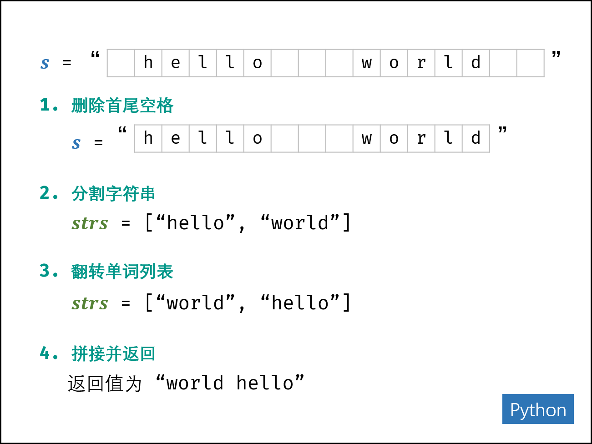

# 剑指 Offer 58 - I. 翻转单词顺序

## 题目

输入一个英文句子，翻转句子中单词的顺序，但单词内字符的顺序不变。为简单起见，标点符号和普通字母一样处理。例如输入字符串"I am a student. "，则输出"student. a am I"。

## 示例

示例 1:

```
输入: "the sky is blue"
输出: "blue is sky the"
```

示例 2:

```
输入: "  hello world!  "
输出: "world! hello"
解释: 输入字符串可以在前面或者后面包含多余的空格，但是反转后的字符不能包括。
```

示例 3:

```
输入: "a good   example"
输出: "example good a"
解释: 如果两个单词间有多余的空格，将反转后单词间的空格减少到只含一个。
```

## 题解

```python
class Solution(object):
    def reverseWords(self, s):
        """
        :type s: str
        :rtype: str
        """
        s = s.strip()
        i = j = len(s) - 1
        res = []
        while i >= 0:
            while i >= 0 and s[i] != ' ':
                i -= 1
            res.append(s[i+1:j+1])
            while s[i] == ' ':
                i -= 1
            j = i
        return ' '.join(res)
```

## 笔记

- 倒序遍历字符串 s，记录单词左右索引边界 i, j；
- 每确定一个单词的边界，则将其添加至单词列表 res；
- 最终，将单词列表拼接为字符串，并返回即可。

### 复杂度分析

- 时间复杂度 O(N)：其中 N 为字符串 s 的长度，线性遍历字符串。
- 空间复杂度 O(N)：新建的 list(Python) 中的字符串总长度 ≤ N ，占用 O(N) 大小的额外空间。

### 简化

利用 Python 内置函数“字符串分割”和“列表倒序” 。

由于 split() 方法将单词间的“多个空格看作一个空格”，因此不会出现多余的“空单词”。因此，直接利用 reverse() 方法翻转单词列表 strs，拼接为字符串并返回即可。

<div align=center></div>

#### python中split()和split(' ')的区别

- 用split(" ")测试：

```python
s1 = "we are family"#中间一个空格
s2 = "we  are  family"#中间两个空格
s3 = "we   are   family"#中间三个空格
s4 = "we    are    family"#中间四个空格

s1 = s1.split(" ")
s2 = s2.split(" ")
s3 = s3.split(" ")
s4 = s4.split(" ")

print(s1)#['we', 'are', 'family']
print(s2)#['we', '', 'are', '', 'family']
print(s3)#['we', '', '', 'are', '', '', 'family']
print(s4)#['we', '', '', '', 'are', '', '', '', 'family']
```

- 用split()测试

```python
s1 = "we are family"#中间一个空格
s2 = "we  are  family"#中间两个空格
s3 = "we   are   family"#中间三个空格
s4 = "we    are    family"#中间四个空格

s1 = s1.split()
s2 = s2.split()
s3 = s3.split()
s4 = s4.split()

print(s1)#['we', 'are', 'family']
print(s2)#['we', 'are', 'family']
print(s3)#['we', 'are', 'family']
print(s4)#['we', 'are', 'family']
```

split()的时候，多个空格当成一个空格；split(' ')的时候，多个空格都要分割，每个空格分割出来空。

简化题解：

```python
class Solution:
    def reverseWords(self, s: str) -> str:
        return ' '.join(s.strip().split()[::-1])
```

python join 用法：

str.join(sequence)

sequence -- 要连接的元素序列。

```python
str = "-";
seq = ("a", "b", "c"); # 字符串序列
print str.join(seq);
```

结果：

```
a-b-c
```