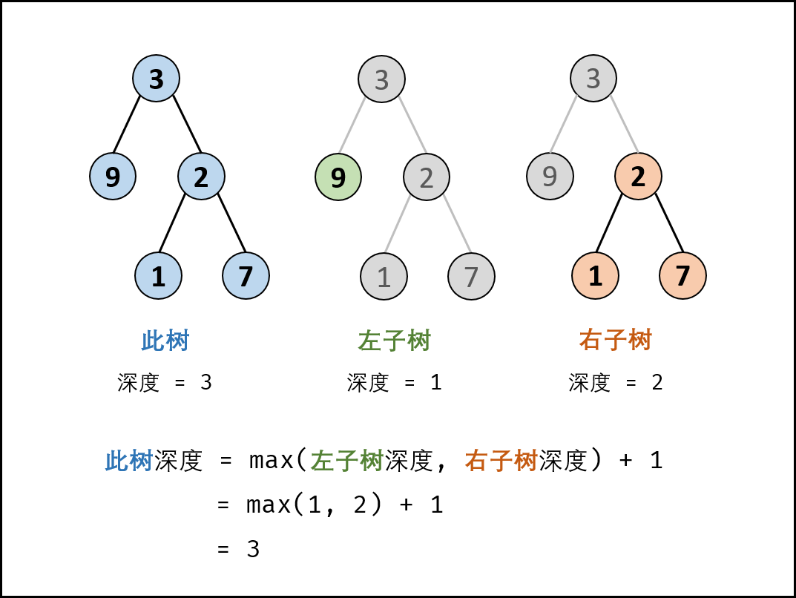

# 剑指 Offer 55 - I. 二叉树的深度

## 题目

输入一棵二叉树的根节点，求该树的深度。从根节点到叶节点依次经过的节点（含根、叶节点）形成树的一条路径，最长路径的长度为树的深度。

## 示例

例如：

给定二叉树 [3,9,20,null,null,15,7]，

```
    3
   / \
  9  20
    /  \
   15   7
```

返回它的最大深度 3 。

## 笔记

### 方法一：后序遍历（DFS）

树的后序遍历/深度优先搜索使用递归实现。

关键点：此树的深度和其左（右）子树的深度之间的关系。显然，此树的深度等于左子树的深度与右子树的深度中的最大值 +1 。

<div align=center></div>

1. 终止条件： 当 root 为空，说明已越过叶节点，因此返回深度 0 。
2. 递推工作： 本质上是对树做后序遍历。
   1. 计算节点 root 的左子树的深度 ，即调用 maxDepth(root.left)；
   2. 计算节点 root 的 右子树的深度 ，即调用 maxDepth(root.right)；
3. 返回值：返回此树的深度 ，即 max(maxDepth(root.left), maxDepth(root.right)) + 1。

```python
class Solution:
    def maxDepth(self, root: TreeNode) -> int:
        if not root: return 0
        return max(self.maxDepth(root.left), self.maxDepth(root.right)) + 1
```

### 方法二：层序遍历（BFS）

- 树的层序遍历/广度优先搜索用**队列**实现。
- 关键点：每遍历一层，则计数器 +1 ，直到遍历完成，则可得到树的深度。

1. 特例处理：当 root 为空，直接返回深度 0 。
2. 初始化：队列 queue （加入根节点 root），计数器 res = 0。
3. 循环遍历：当 queue 为空时跳出。
   1. 初始化一个空列表 tmp，用于临时存储下一层节点；
   2. 遍历队列：遍历 queue 中的各节点 node ，并将其左子节点和右子节点加入 tmp；
   3. 更新队列：执行 queue = tmp ，将下一层节点赋值给 queue；
   4. 统计层数：执行 res += 1 ，代表层数加 1；
4. 返回值： 返回 res 即可。

```python
class Solution:
    def maxDepth(self, root: TreeNode) -> int:
        if not root: return 0
        queue = [root]
        res = 0
        while queue:
            tmp = []
            for node in queue:
                if node.left: tmp.append(node.left)
                if node.right: tmp.append(node.right)
            queue = tmp
            res += 1
        return res
```

# 剑指 Offer 55 - II. 平衡二叉树

## 题目

输入一棵二叉树的根节点，判断该树是不是平衡二叉树。如果某二叉树中任意节点的左右子树的深度相差不超过1，那么它就是一棵平衡二叉树。

## 示例

示例 1:

给定二叉树 [3,9,20,null,null,15,7]

```
    3
   / \
  9  20
    /  \
   15   7
```

返回 `true` 。

示例 2:

给定二叉树 [1,2,2,3,3,null,null,4,4]

```
       1
      / \
     2   2
    / \
   3   3
  / \
 4   4
```

返回 false 。

## 题解

以下两种方法均基于以下性质推出： 此树的深度等于左子树的深度与右子树的深度中的最大值 +1 。

### 方法一：后序遍历 + 剪枝 （从底至顶）

此方法为本题的最优解法，但剪枝的方法不易第一时间想到。

思路是对二叉树做后序遍历，从底至顶返回子树深度，若判定某子树不是平衡树则 “剪枝”，直接向上返回。

#### recur(root) 函数：

- 返回值：
  1. 当节点 root 左/右子树的深度差 ≤1 ：则返回当前子树的深度，即节点 root 的左/右子树的深度最大值+1 （max(left, right) + 1）；
  2. 当节点root 左/右子树的深度差 >2 ：则返回 −1 ，代表此子树不是平衡树。
- 终止条件：
  1. 当 root 为空：说明越过叶节点，因此返回高度 0 ；
  2. 当左（右）子树深度为 −1 ：代表此树的左（右）子树不是平衡树，因此剪枝，直接返回 −1 ；

#### isBalanced(root) 函数：

- 返回值：若 recur(root) != -1 ，则说明此树平衡，返回 true；否则返回 false。

```python 
class Solution:
    def isBalanced(self, root: TreeNode) -> bool:
        def recur(root):
            if not root: return 0
            left = recur(root.left)
            if left == -1: return -1
            right = recur(root.right)
            if right == -1: return -1
            return max(left, right) + 1 if abs(left - right) <= 1 else -1

        return recur(root) != -1
```

### 方法二：先序遍历 + 判断深度 （从顶至底）

此方法容易想到，但会产生大量重复计算，时间复杂度较高。

思路是构造一个获取当前子树的深度的函数 depth(root)，通过比较某子树的左右子树的深度差 abs(depth(root.left) - depth(root.right)) <= 1 是否成立，来判断某子树是否是二叉平衡树。若所有子树都平衡，则此树平衡。

#### isBalanced(root) 函数： 判断树 root 是否平衡

- 特例处理：若树根节点 root 为空，则直接返回 true ；
- 返回值：所有子树都需要满足平衡树性质，因此以下三者使用与逻辑 && 连接；
  1. abs(self.depth(root.left) - self.depth(root.right)) <= 1 ：判断当前子树是否是平衡树；
  2. self.isBalanced(root.left) ：先序遍历递归，判断当前子树的左子树是否是平衡树；
  3. self.isBalanced(root.right) ：先序遍历递归，判断当前子树的右子树是否是平衡树；

#### depth(root) 函数：计算树 root 的深度

- 终止条件： 当 root 为空，即越过叶子节点，则返回高度 0；
- 返回值： 返回左 / 右子树的深度的最大值 +1 。

```python

```