# Interpreting Super-Resolution Networks with Local Attribution Maps

Jinjin Gu，董超

## 摘要

进入深度学习时代以来，超分方向的研究不断取得进展，SOTA 被一次又一次刷新。然而 SR 研究也有着深度学习的通病，许多模型难以定量地去解释和分析，很多时候我们只知道某个模型 work，但究竟是怎么 work 起来的，如何启发我们进行改进，目前还没有明确的答案。

举几个简单的例子。

- SR 问题旨在从低分辨率图像 LR 恢复到高分辨率图像 HR，其中的关键在于更好地从 LR 上提取 HR 需要的信息。而在 CNN 模型中，receptive field（感受野）决定了 HR 能“看到”的 LR 范围，那么是不是只要加大 receptive field 就能获得更好的性能呢？
- 近年来兴起的具有全局视野的 attention 和 non-local 机制，是否蕴含着更大的潜力？
- 或者更进一步，模型结构对 LR 信息的利用效率以及模型最终的性能有着怎样的影响？

对于以上问题，本文认为需要发展针对 SR 领域的 attribution analysis（归因分析），以更好地理解模型，从而为改进模型指明方向。

说到归因分析，其实在 classification 分类问题上已经有一定的进展，本文旨在结合 SR 的特性，将分类问题的归因分析方法迁移到 SR 问题上，找到对 SR 结果有重大影响的输入像素。

提出了一种新的归因方法， local attribution map，LAM。继承了 integral gradient 方法，但有两个特点：

1. 使用模糊图像作为 baseline 输入
2. 采用渐进模糊函数作为 path fuction。

## 一、简介

### 1.1 Motivation

与以往的工作不同，不追求更高的精度，或是更快的速度，而是深入地解析、了解超分网络内部发生了什么。

在 high-level 里面可解释性的工作很多，但是 low-level 里面可解释性的工作比较少，这篇文章作为一个早期的探索。

Low-level 任务：常见的包括 Super-Resolution，denoise， deblur， dehze， low-light enhancement， deartifacts 等。简单来说，是把特定降质下的图片还原成好看的图像，现在基本上用 end-to-end 的模型来学习这类 ill-posed 问题的求解过程，客观指标主要是 PSNR，SSIM，大家指标都刷的很高。目前面临以下几点问题：

- 泛化性差，换个数据集，同种任务变现就很差
- 客观指标与主观感受存在，GAP，指标刷很高，人眼观感不佳，用 GAN 可缓解
- 落地的问题，SOTA 模型运算量很（上百 G Flops)，但实际不可能这么用
- 主要是为人眼服务，缺乏与 High-level 之间的联系

High-level 任务：分类，检测，分割等。一般公开训练数据都是高品质的图像，当送入降质图像时，性能会有下降，即使网络已经经过大量的数据增强（形状，亮度，色度等变换）

真实应用场景是不可能像训练集那样完美的，采集图像的过程中会面临各种降质问题，需要两者来结合。简单来说，结合的方式分为以下几种

- 直接在降质图像上 fine-tuning
- 经过 low-level 的增强网络，再送入 High-level 的模型，两者分开训练
- 将增强网络和高层模型（如分类）联合训练

SR 发展非常迅速，有非常多的网络提出来，有新的 block 用到 SR 网络里，也可以看到 performance 在不断提升，我们想知道 performance 的提到底究竟是源于什么？

attention 用于 SR，效果是好，但 attention 为什么使得效果好了？

复杂的 block 或 connection，是不是复杂的 connection 发挥了作用，而不一定是 block 本身？

探究什么使网络变得更好？

- Do you need multi-scale architecture or a larger receptive field? 
- Does non-local attention module work as you want?
- Why different SR networks perform differently?

三个层面：

1. Pixel: What pixels contribute most to restoration?
2. Feature: Where can we find semantics in SR networks?
3. Filters: Whether learned filters are discriminative?Filters 是不是 disentangled，可以拆解出来？

本文从 Pixel 的角度解释超分网络。不同的网络虽然展现出来的 performance 即便是一样，但是恢复出来的图像是有差异的，在不同的地方展现出不同的效果。

### 1.2 Contributions

## 二、相关工作

### 2.1

### 2.2 Network interpretation

基于分类问题归因分析中的 **integrated gradient**（积分梯度）方法。

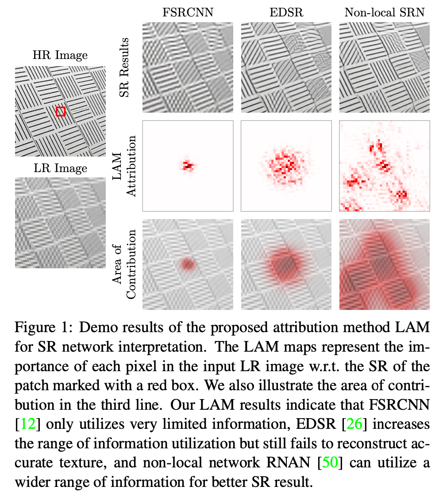

对 HR 图像中间红框处的超分结果进行归因分析，右边 LR 图像上标红的像素即为对该超分结果“贡献大”的像素。那么如何定义“贡献”，又怎样找出“贡献大”的像素呢？这要从 saliency map 说起。

> **Deep Inside Convolutional Networks: Visualising Image Classification Models and Saliency Maps (ICLR 2014)**

这篇 ICLR 提出了早期的归因分析方法，并将归因结果图称为 saliency map。思想十分简单，就是用**梯度**来衡量“贡献”。

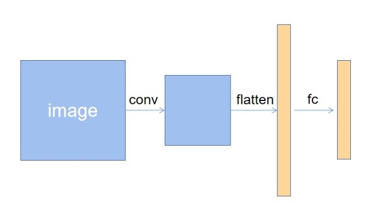

常见的分类网络结构如上图：输入图片经过若干卷积层，变换为向量，再经过若干 mlp 映射到得分向量（中间搭配 ReLU，maxpooling 等），一般而言，对于 C 分类问题，得分向量维度为 C。

假设现在给定一张图片，前向传播后得分最高的是 c 类别，我们想探究图片中哪些像素导致模型将其判定为类别 c。只关注得分向量的 c 分量（对应类别 c），那么模型是一个从输入图片到实数的映射，即**多元实函数**。论文提出用类别 c 得分对输入的每个变量（即图片的每个像素）的偏导数的绝对值来衡量该变量的“贡献”。

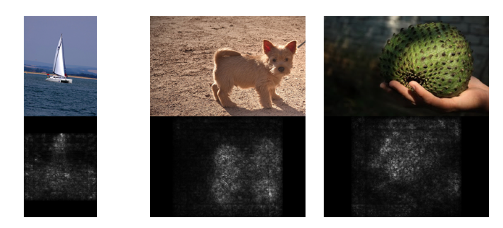

这是论文中展示的部分 saliency map 结果，基本上能将目标物体所在的像素标记出来，符合我们的预期。

值得一提的是，由于模型引入了非线性激活函数（例如 sigmoid，ReLU），相当于嵌套了复合函数，才使得 saliency map **结果与输入本身也有关，而不是单纯由模型参数决定**。这一点可以用多元复合函数求导验证一下。

但是 saliency map 仍存在一些不足，于是之后提出了 integrated gradient 方法。

> **Axiomatic Attribution for Deep Networks （ICML 2017）**

2017 年的这篇 ICML 提出归因分析方法应该满足的几条性质，并证明了现有的基于梯度的各种方法都无法满足所有性质。

例如，非线性激活函数带来的梯度消失，可能让目标物体的重要部位得到很小的梯度，无法在 saliency map 上展现出来。种种反例揭示了直接用梯度来衡量“贡献”是不合理的。

为此，论文提出 integrated gradient 方法。作者认为，既然想分析贡献大的重要部分，那首先得找一张去掉重要部分的图片作为参照啊。这便是论文提出的 baseline，最简单地，可以取全黑的图片。

将输入记为 $x$，baseline 记为 $x'$，对于第 i 个变量（像素），其“贡献”定义如下：

$$
\text { IntegratedGrads }_{i}(x)::=\left(x_{i}-x_{i}^{\prime}\right) \times \int_{\alpha=0}^{1} \frac{\partial F\left(x^{\prime}+\alpha \times\left(x-x^{\prime}\right)\right)}{\partial x_{i}} d \alpha
$$

作为推广，可以更一般地取路径 $\gamma$ 和 baseline $x'$，衍生出不同的方法：

$$
\text { PathlntegratedGrads }_{i}^{\gamma}(x)::=\int_{\alpha=0}^{1} \frac{\partial F(\gamma(\alpha))}{\partial \gamma_{i}(\alpha)} \frac{\partial \gamma_{i}(\alpha)}{\partial \alpha} d \alpha
$$

直观理解：

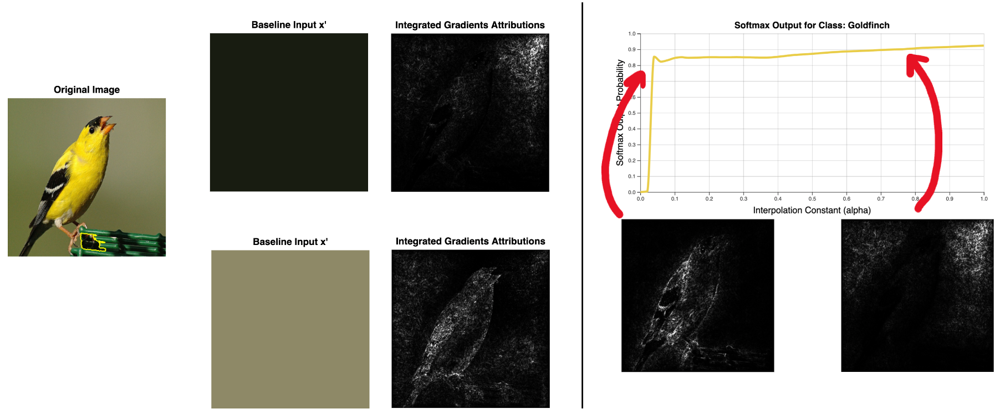

最后，论文证明了 integrated gradient 可以满足所提出的几条性质，也展示了和 saliency map 的比较结果。

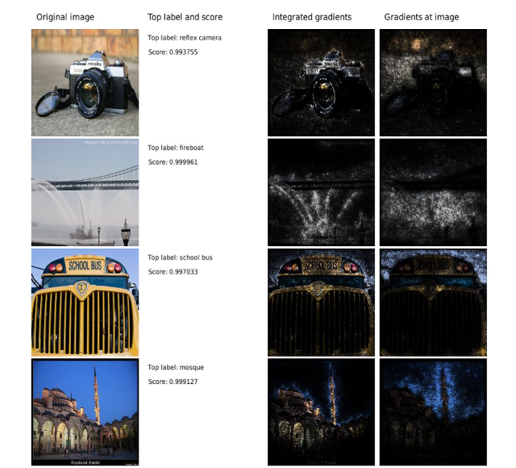

## 三、方法

Integrated Gradient 可以取不同的路径 $\gamma$ 和 baseline $x’$。
实际上，Local Attribution Maps（LAM）就是根据 SR 问题的特性，适当取 $\gamma$ 和 baseline 得到的。

首先 SR 问题所具有的特性：
1. Interpreting local not global
2. Interpreting hard not simple
3. Interpreting feature not pixels

**Whether there exists edges/textures or not, instead of why these pixels have such intensities.**

简单来说，SR 问题具有较强的局部相关性，我们不会对整张（global）SR 结果进行归因，而是只取其中一个 patch （local）。

另外，由于 SR 的主要难点在于高频纹理的重建，平坦的区域（simple）常常只需要简单的插值即可完成恢复，因此我们只取复杂的 patch （hard）进行归因。

最后，不同于分类问题输出的得分，SR 输出的是像素，而单个像素本身是数值大小是没有明显语义信息的。因此不能照搬分类问题中取出某个输出分量（pixel）进行归因分析的做法。论文的解决办法十分巧妙：用 sobel 算子在 SR 的 patch 上做卷积再求和，作为归因分析的对象。一来提取了 patch 的梯度信息（feature），具有一定的高层语义；二来将输出 SR 进一步映射到一维实数，整个模型化为多元实函数，从而可以运用 integrated gradient 方法。

sobel 主要用于获得数字图像的一阶梯度，常见的应用和物理意义是边缘检测。sobel 是把图像中每个像素的上下左右四领域的灰度值加权差，在边缘处达到极值从而检测边缘。

low level 的话归因回去，就一定会归因到原图。因为我们知道输出的所有像素利用了输入的所有像素。

超分本质，让图片不太 sharp 的地方变得 sharp。也就是梯度发生了变化。那些像素使得 edge 变得更好了？

通过路径积分来做积分回传，很重要的参数 $\gamma$，用来控制积分 feature 从无到有的过程，对于超分就是 edge 从无到有，或者从不够 sharp 到非常 sharp 的过程。

对于 low-level 来讲，最重要的是对同一个局部的处理，不同的网络是不是利用到了不同的像素，用量化的技巧来衡量利用了多少像素。

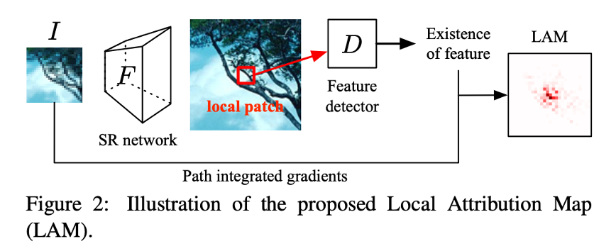

$F$ 即为 SR 网络，$D$ 为上述 sobel 特征提取器。

最后是 $\gamma$ 和 baseline 的选择。

论文指出，对于 SR 问题，重要的是高频细节纹理，baseline 应取为丢失高频后的输入图像。又考虑到线性路径不够“自然”，带有过重的人为因素，且不能反映高频信息的逐步丢失，文章提出用不同 $\sigma$ 的高斯模糊核作为路径。

- Blurred image as baseline input： $I'=\omega(\alpha)\otimes I$
- Progressive blurring path function：$\gamma_{pb}(\alpha)=\omega(\sigma-\alpha\sigma)\otimes I$

$\alpha$ = 0 时，标准差为 $\sigma$，对应模糊程度最大的 baseline；$\alpha$ = 1 时，标准差为 0，对应原始输入图像 $I$。

如此，LAM 方法已经明了。本质上是基于 integrated gradient，根据 SR 问题的特性，取适当的路径 γ 和参照 baseline。

$$
\operatorname{LAM}_{F, D}(\gamma)_{i}:=\int_{0}^{1} \frac{\partial D(F(\gamma(\alpha))}{\partial \gamma(\alpha)_{i}} \times \frac{\partial \gamma(\alpha)_{i}}{\partial \alpha} d \alpha
$$

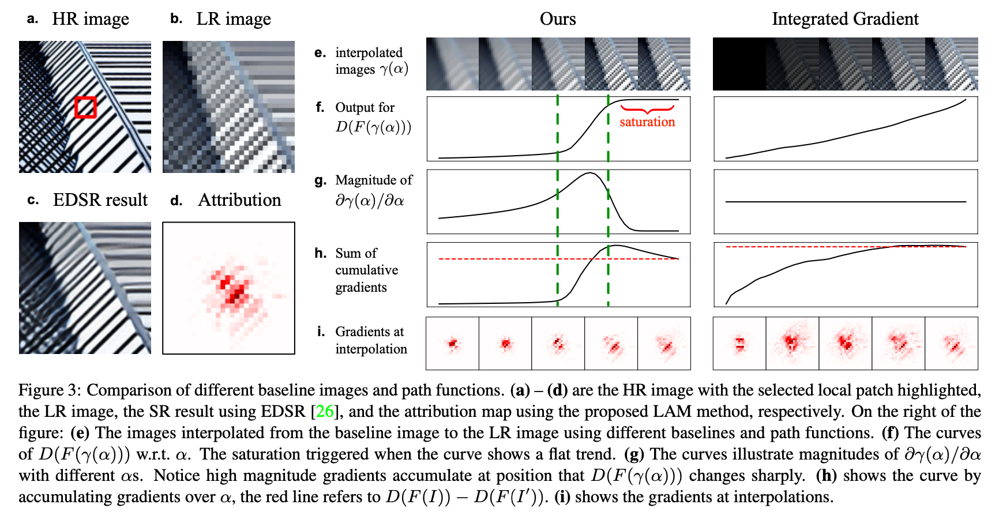

## 四、实验

### 4.1 Collection of Test Set and Visualization Method

### 4.2 Diffusion Index for Quantitative Analysis

量化：对比性的工作，基尼系数评判国家贫富差距，这里评判用像素的差距，将用到的突出的像素的比例突出出来。

只利用到了非常少的像素，贡献在像素之间是不均等的，基尼系数会很高，分散系数就会很低。

当大量像素参与到了超分重建的过程中，贡献在像素之间比较平均，贫富差距不是很大，分散系数就会很高。

$$
G=\frac{\sum\limits_n^i\sum\limits_n^i\mid g_i-g_j\mid }{2n^2\overline g}
$$

$$
DI = (1 − G) × 100
$$

### 4.3 Attribution Results

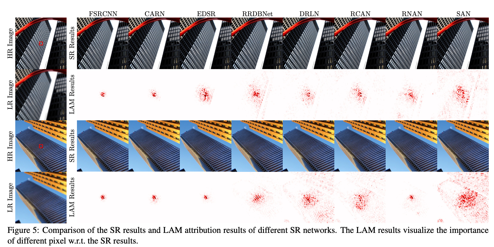

### 4.4 Exploration with LAM

#### Diffusion Index vs. Network Performances

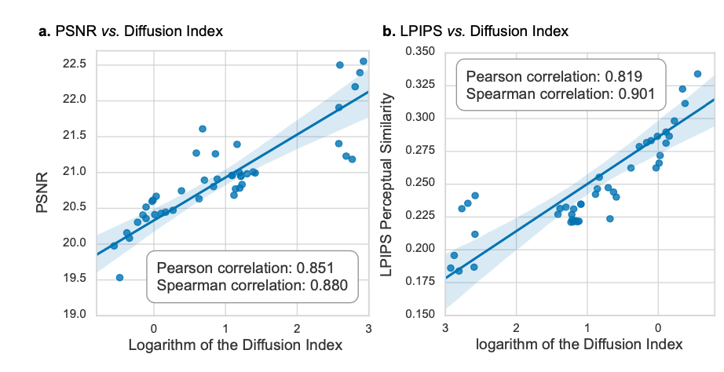

#### Diffusion Index vs. Receptive Field

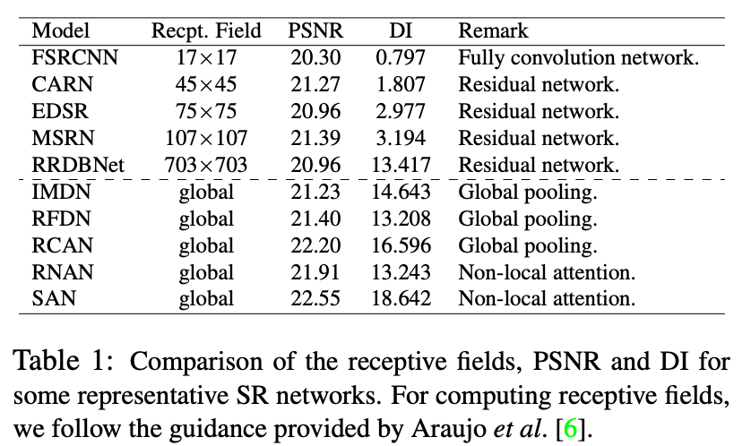

#### Diffusion Index vs. Network Scales

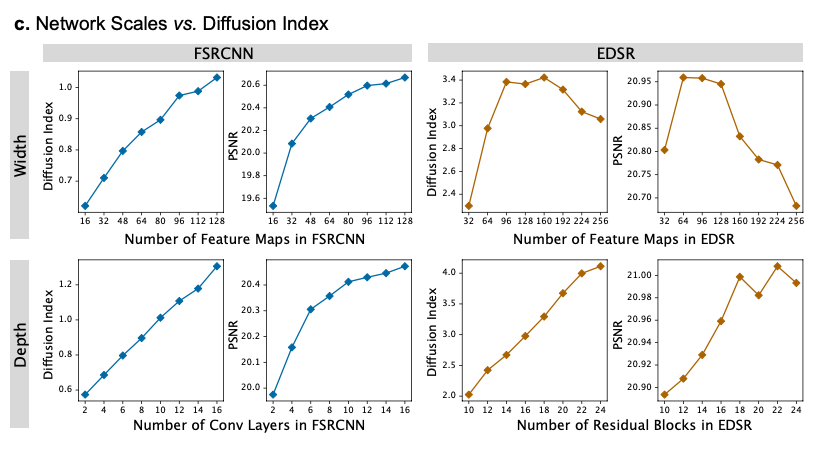

#### Diffusion Index vs. Image Content

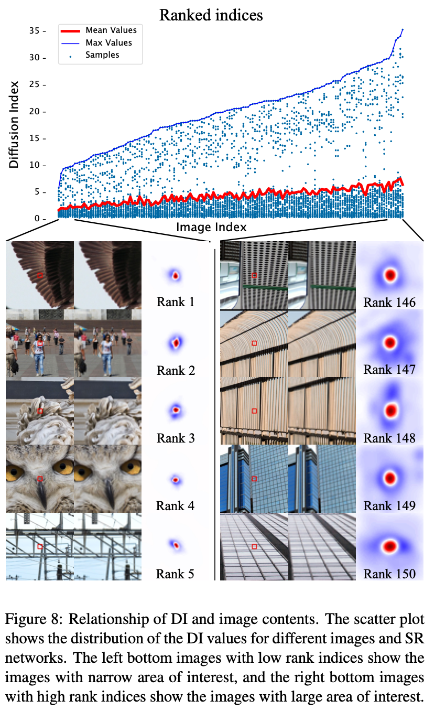

## 五、总结

## 六、思考

LAM 方法基于 Integrated gradient，但 Integrated gradient 本身不是完美的。

按照公式，其结果很大程度取决于 $\gamma$ 和 baseline 的选取，带有强烈的人为设定因素，而不是一个确切的真理性结果。用这种方法来“解释”模型，对模型结果进行归因分析，是否不够合理？换句话说，选取“合适”的 $\gamma$ 和 baseline 可以得到“合理”的归因结果，但这个“合理”是以是否符合人类的直观理解来界定的，不一定能真正展示模型的原理。从这个角度看，似乎 Saliency map 这种直接求梯度的方法反而更合理一些。

另外，正如论文的 Motivation 所述，我们希望对模型进行归因分析，从而更好地理解并改进模型。但 LAM 只是展示了在其定义的“贡献”度量下，哪些像素“贡献大”，具体是怎样“贡献”的仍然没有明确的答案。如何从中得到指引，帮助设计模型，更有效利用信息？这些问题，还需要我们进一步的探索。