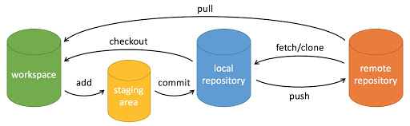

# 数学

## 微积分

微分-导数（推导梯度下降）。

掌握上确界和下确界的概念有助于我们理解诸如Wasserstein距离，它作为一种损失函数被应用于WGAN以解决训练不稳定的问题。此外，有涉及到GAN方向的同学也可以理解下Lipschitz连续性的概念，它对提高GAN训练的稳当性分析具有不可替代的作用。

对于基础的深度学习原理来说，更多的需要掌握的概念是：**梯度、偏导数、链式求导法则、导数与函数的极值&单调性&凹凸性判断、定积分与不定积分**。最后，可以着重理解下**泰勒公式**，它是理解各种优化算法的核心。

## 线性代数与矩阵论

由于计算机现有的运算方式大都是基于并行计算的，无论是机器学习或者深度学习模型来说，数据都是以矩阵或者向量化的形式传入的。

明白**线性空间、向量、标量、矩阵、范数、秩**的概念以及着重掌握矩阵和向量的基本运算方式，这对于理解一些网络模型结构，如自注意力机制是非常有必要的。

理解**特征值、特征向量以及矩阵的正定**概念，同时也应该掌握**特征值分解**（主成分分析和线性判别分析等）以及**奇异值分解**（正太贝叶斯分类器及主题模型等）。矩阵论则是线性代数的进一步升华，所要掌握的重点知识为**矩阵分解、线性变换、相似矩阵、欧式空间、正交矩阵、对称矩阵、正定矩阵**。

## 概率论与信息论

**随机变量、概率分布、条件概率、统计与假设检验、概率密度及质量函数、贝叶斯公式、期望、方差、协方差**。

掌握一些常见的分布函数，如**0-1分布、二项分布（伯努利分布）、几何分布、高斯分布、指数分布、泊松分布**。最后，还应该重点理解**最小二乘法、最大似然估计、指数移动平均**等。

对于信息论来说，最需要掌握的一个知识点必定是**熵**。除了理解熵的概念以外，可以着重了解下几种不同的熵理论，如**条件熵、联合熵、相对熵、最大熵以及互信息**。

## 最优化方法

最优化，直白的说便是指在完成一个目标的时候，我们总是希望能够在资源受限的条件下以最小的代价来获取最大的收益。可以毫不夸张的说，最优化理论是整个机器学习中相对较难且非常重要的一个理论基础，同时也是面试机器学习算法岗或者在该领域继续进修所必不可少的一个门槛。

最优化问题中基本数学描述的三个基本要素，即**决策变量、目标函数以及约束条件**。

**凸集、凸函数、凸集分离定理、超平面和半空间**。

最后，需要重点理解的便是梯度下降法，它是目前整个深度学习算法的核心。**拟牛顿法、阻尼牛顿法、随机梯度下降算法**等。

# 计算机基础

## Git基础

从逻辑上，git所管理的代码可以分为三个区，如图所示分别为工作区(你正在编写的代码)，本地仓库（保存到本地仓库的代码）以及远程仓库（远程代码库），它们之间的转换所需要用到的命令如上图所示。比如 git commit（提交至本地仓库），git push（把本地代码推到远程库并进行合并），git pull（把远程代码下载下来并合并到工作区），git diff（比较工作区与暂存区的不同）。

## Linux基础

- 基本操作：mv(移动)，rm(删除)，cp(复制)，mkdir(创建文件夹), touch(创建文件), scp(用于传送文件)，cat(打印文件到命令行)，grep(查找符合条件的字符串)，ls(查看文件)，chmod(修改权限)，ln(创建软链接)
- 压缩/解压命令 ：zip/unzip和tar命令
- 系统监控相关：ps(查看进程)，top(类似任务管理器)，df(查看磁盘占用)
- 网络相关：ping(判断网络是否可达)，ifconfig（显示网络设备状态）
- 显卡状态：nvidia-smi（需要安装），gpustat（需要安装，这个显示更美观）
- 后台运行：nohup（关掉终端也不会停止运行），ctrl+z（切换到后台，关闭终端会结束）

## 算法基础

**数组、字符串、链表、栈、队列、哈希表、二叉树、堆、递归、深搜广搜、动态规划**。

- 看懂题目（1-2min）
- 设计数据结构+算法，尽量回想一下同类型的题目（1-2min）【没有思路直接去看题解】
- 尝试动手将整份代码给敲出来，争取把给定的测试用例都通过（3-5min）
- 最后剩下最苦逼的便是调bug了（0-∞min）

许多题目往往有一套固定的解题模板，而我们需要做的是应用好这套模板去解决问题。

## 编程基础

### Python

用于数据分析的Numpy、Pandas；用于可视化的Matplotlib、Seaborn；用于机器学习的Scikit-learn；用于图像处理的Opencv、Scikit-image等。

### C++

C++部署一般有两种形式。第一种是利用C++从头搭建模型，实现模型训练和推理。第二种是前期先利用Python搭建网络进行训练，后期再将模型载入C++中实现推理。前者开发难度偏大，商用价值较高。而后者开发难度适中，且能满足大多数项目的需求。对于后者，部署C++有两种常用方式：**Pytorch → libtorch** 和 **Pytroch → onnx → tensorrt**。

# 数据分析与数字图像处理基础

## 数据处理与分析

深度学习项目的成功落地三要素：数据、算法和算力，数据有效地处理与分析是非常关键的一步。简单来说，数据处理与分析即是从大量的、杂乱无章的数据中抽取并分析出有价值的信息。

在近十几年的发展上来看，算法本身的创新是非常有限的，大都还是停留在修修补补的阶段。对于一名普通的计算机视觉算法工程师来说，工作中有80%的时间都是在处理数据，因为模型的改动需要考虑到底层算子的适应性，效果不一定好并且工作量会大大增加。因此，要学会根据实际应用场景针对性地分析业务需求，通常是基于已开源的大数据集作为pretrain，然后利用业务数据集来finetuning。所以重心还是要学会对业务数据进行**数据清洗**以及选择合适的**数据增广**方式来扩充有限的数据集。而对于一名数据竞赛者来说，更多的应该了解如何开始一个比赛。

Exploratory Data Analysis： 导入数据 → 数据总览 → 变量相关性分析 → 缺失值及异常值处理 → 数据分布变换 → 特征分析（数值型和类别型）；

Feature Engineering： 异常值处理（通过箱形图观察及长尾截断处理等）→ 缺失值处理（分为随机性缺失和非随机性缺失，对应的处理方法分别为RF、SVD、Mean、Median、KNN、NN & Binary、GSimp、QRILC 等）→ 特征离散化 → 数据类型转换（one-hot编码、哈夫曼编码等）→ 特征组合（将具有相关性的特征组合起来形成新的特征，以此来丰富特征的多样性，提高模型的泛化能力）→ 数据降维（PCA）；

Modeing： 选择合适的模型（LightGBM & XGBoost等）→ 交叉验证 → 模型调整（GridSearch & Bayes & 贪心调参等）；

Ensemble： 一般选定3个左右的强模型+多个相关性较小的弱模型进行Voting or Stacking or Boosting。

## 数字图像处理

数字图像处理（Digital Image Processing）是通过计算机对图像进行去噪、增强、复原、分割、提取特征等处理的方法和技术。

尽管深度学习能实现很高的性能，但目前为止人们仍难以解释其内部工作的机制原理。因此，深度学习本质上还是一个黑盒子。了解数字图像的一些基本概念以及掌握基础的图像处理技能，有助于我们理解更深层次的内容。

### 1. 图像数字化

指的是将模拟（连续）信号的图像转换为数字（离散）信息的过程，主要包含**采样和量化**两个步骤。二维图像在计算机中通常是以矩阵的形式表示，这里需要了解图像的一些基本属性，如**图像格式**（BMP & JPEG & GIF & PNG的定义和区别）、**图像分辨率和通道数**（8位单通道二值图像 & 24位RGB通道彩色图像 & 32位RGBA通道 & 以及各种通道之间的互相转换）、**图像尺寸**（像素 & 图像宽度和高度）、**图像色彩颜色空间**（RGB & HSV & HSI & CMYK）、**图像插值方法**（最近邻插值、双线性插值、三线性插值）及**图像成像方式**（伽马射线 & X射线等）。

### 2. 图像压缩

目的是减少图像中的冗余信息，以更高效的格式进行存储和传输数据。一般可分为有损压缩和无损压缩，这里我们只需要简单了解下有哪些经典的压缩算法即可。有兴趣的可以了解下JPEG压缩算法的原理和步骤（涉及**离散余弦变换 & 量化 & YCbCr色彩空间**）

### 3. 图像增强

指的是利用各种数学方法和变换手段来提高图像对比度与清晰度，使改善后的图像更适应于人的视觉特性或易于机器识别。简单来说，就是要突出感兴趣的特征，抑制不感兴趣的特征，从而改善图像质量。如强化图像中的高频分量，可使图像中物体轮廓清晰，细节更加明显；而强化图像中的低频分量可以减少图像中的噪声影响。这里需要重点掌握的是**灰度直方图**的概念，了解什么是**直方图和对比度，掌握直方图均衡化、限制对比度的自适应直方图均衡化（CLAHE）以及伽马校正和仿射变换操作**。

### 4. 图像复原

指的是利用退化过程的先验知识，去恢复已被退化图像的本来面目。这是由于受采集设备和光照等外部环境的影响，图像在形成的过程中不可避免的会失真或者引入背景噪声干扰。因此首先要知道噪声的来源（电子元器件发热或传输损失 & 成像系统的调制与缺陷 & 光照等外部环境因素的干扰）以及**各种噪声的来源和特点**（高斯噪声 & 脉冲噪声[椒盐噪声/胡椒噪声/盐粒噪声] & 泊松噪声 & 斑点噪声）。最后便是如何去噪，这里需要重点掌握一些**常见的线性和非线性滤波算法**（均值滤波 & 中值滤波 & 维纳滤波 & 卡尔曼滤波 & 高通滤波 & 低通滤波 & 高斯滤波 & 双边滤波 & 拉普拉斯滤波 & 卷积核 & Gabor滤波器）。需要注意的是，我们在学习的过程中不能停留在定义上，而是应该着重理解各种滤波背后的**工作原理及应用范围**，如低通滤波可用于消除噪声、高通滤波常用语提取边缘，又比如高斯滤波就是用来去除高斯噪声、均值滤波和中值滤波有助于去除胡椒噪声、边滤波则能够在滤波的同时保证一定的边缘信息，但是计算复杂度较高。

### 5. 图像基本运算

指的是对图像执行一些基本的数学运算。这里涉及到的运算主要可分为**点运算**（线性 & 分段 & 非线性点运算）、**代数运算**（加法 & 减法运算）、**逻辑运算**以及最重要的**几何运算**（图像平移 & 旋转 & 翻转 & 镜像 & 缩放）

### 6. 图像边缘检测

这里仅需了解下有哪些边缘检测算子以及重点掌握一些常见的算子。如**一阶微分算子**（Sobel算子 & Roberts算子 & Prewitt算子）、**二阶微分算子**（Laplacian算子 & LOG算子）及Canny算子。

### 7. 图像形态学操作

指的是一系列处理图像形状特征的图像处理技术。这里需要着重掌握的有**腐蚀和膨胀、开运算与闭运算、形态学梯度（用于保留边缘轮廓）、白色和黑色顶帽变换**；此外，也可了解下细化、厚化、击中击不中变换、边界/孔洞/联通分量提取。

### 8. 图像变换

指的是将图像阵列从源域转换到目标域。了解几种常见的变换方式，如**傅里叶变换、离散余弦变换**。此外，可以重点学习下用于特征提取的**霍夫变换**，实战下如何利用该技术进行直线、圆和弧线等局部特征的提取。最后，再重点梳理下傅里叶变换与小波变换之间的区别和联系。

### 9. 图像分割

主要是基于灰度值的不连续和相似的性质将图像划分为前景区域和背景区域。对于不连续的灰度值，常用的方法是边缘检测。而对于相似的灰度，我们一般常用**阈值处理（局部多阈值 & 全局阈值 & Otsu自适应阈值）、区域生长、分水岭算法**等。

### 10. 图像质量评价

主要是对图像的某些特性进行分析研究，评估出图像的失真程度。这里需要重点掌握几个评价指标：SSIM（结构相似度）、PSNR（峰值信噪比）及MSE（均方误差）。

# 机器学习与深度学习基础

## 机器学习

- 了解并区分什么是监督学习、无监督学习、半监督学习、弱监督学习、多示例学习、迁移学习、元学习、强化学习、对比学习、少样本学习、零样本学习；
- 了解参数与超参数、数据拟合（欠拟合、过拟合、Under fit）、偏差与方差、训练集/验证集/测试集、生成模型与判别模型、奥卡姆剃刀/丑小鸭定理/没有免费午餐、样本统计（TP/TN/FP/FN）、交叉验证、参数搜索的概念；理解损失函数、梯度下降、正则化（L1 & L2）、数据降维（PCA & LDA）、数据归一化（Min-Max 标准化 & Z-score标准化）等原理及适用场景；
- 掌握机器学习的十大基础算法，即Linear Regression、Logistic Regression、LDA、LVQ、Naive Bayes、KNN、Random Forest、Decision Tree、SVM、Bagging&Boosting&AdaBoost及K-Means算法。梳理各种树模型（GBDT & XGBoost & RF）之间的原理和区别；
- 理解掌握常用的评价指标，如Accuracy、Recall（Sensitivity）、Precision、Dice（F1-score）、Jaccard、AUC曲线、P-R曲线、MIoU等。
- 学有余力的可以了解下期望最大化、隐马尔科夫模型及条件随机场等原理。

## 深度学习

- 了解相关的一些高频名词和计算机视觉有哪些应用方向；

### 卷积结构

Plain Conv, DW Conv, Ghost Conv, Deformer Conv, Octave Conv, Gropu Conv, 1×1 Conv, HetConv, Dilated Conv, SCCov, Pyramid Conv, Tined Conv, Dynamic Conv, Decoupled Dynamic Conv,  Involution, etc.

### 激活函数

Sigmoid, Softmax, ReLU, Tanh, PReLU, ELU, GELU, SELU, LeakeReLU, Soft Plus, ACON, etc.

### 损失函数

Binary/Weighted/Balanced Cross-Entropy, Mixed Focal/Focal Loss/GFocal Loss, Dice Loss, IoU/CIoU/GIoU/DIoU/CDIoU/EIoU Loss/Focal-EIOU Loss, Tversky Loss, Triplet loss, etc.

### 池化相关

Max pooing, Average pooling, GAP, Stochastic pooling,  etc.

### 优化方法

Adam、SGD、Adentum、Nesterov、AdaDelta、RMSprop, etc.

### 正则化技术

Dropout, DropBlock, Label Smoothing, SelfNorm & CrossNorm, etc.

### 后处理技术

Watershed algorithm、CRF、TTA、Overlap Prediction、NMS, etc.

### 归一化技术

BN, LN, GN, IN, BGN, SwitchableN, SBN, SSN, FRN, EBN, KalmanN, DualN, etc.

### 学习率衰减

ReduceLROnPlatea, MultiStepLR, ExponentialLR, CosineAnnealingLR, StepLR, etc.

### 注意力机制

SE, SK, Shuffle Attention, Non-local, CBAM, GC, OCR, CBM, CBAM, BA2M, FCANet, Coordinate Attention, etc.

### 多尺度机制

ASPP, SPP, Big-Little, Inception, SFA, ASC, DCFAN, etc.

### 特征可视化技术

CAM, Grad-CAM, Grad-CAM++, Smooth Grad-CAM++, score-CAM, ss-CAM, Ablation CAM, etc.

### 数据增强

- 几何增强： Horizontal/Vertical flip, Rotation, Affine transformation, Translation, Cropping, Perspective transformation, Zoom, etc.
- 色彩增强： Contrast, Brightness, Saturation, Color space conversion, Color jitter, Channel shuffling, Filling, Superimposed noise, etc.
- 其它增强： Mixup, RandAugment, mosaic, dropout, cutout, cutmix, augmix, MoEx, RandErase, ObjectAug, InAugment, KeepAugment, Co-Mixup, ISDA, etc.

### 距离度量公式

Manhattan Distance, Euclidean Distance, Chebyshev Distance, Minkowski Distance, Cosine Distance, Mahalanobis Distance, Hamming Distance, Edit Distance, Earth Mover's distance，etc.

### Backbone

**LeNet-5, AlexNet, VGGNet, GoogleNet, ResNet, DenseNet, VoVNet, MoblieNet, ShuffleNet, Xception, queezeNet, RexNeXt, Res2Net, SENet, SKNet, DCNet, CSPNet, FBNet, EfficientNet, RegNet, ResNeSt, ReXNet, HaloNets, etc.**

### 语义分割

FCN, UNet, ENet, ThunderNet, RefineNet, SegNet, PSPNet, DeepLab, DenseASPP, OCRNet, HRNet,BiSeNet, etc.

### 目标检测：

- Two-stage： R-CNN & SPP & FastR-CNN & Faster R-CNN & Cascade-RCNN & Sparse R-CNN, etc.
- One-stage： YOLO v1-v5 & PPYOLO & SSD & RetinaNet & RefineDet & YOLOR & YOLOF & YOLObite & NanoDet & OneNet, etc.
- Anchor-free： CornetNet & Objects as Points & CenterNet v1-v2 & FCOS, etc.

### 实例分割

MaskRCNN, PolarMask, PolarMask++, PointRend, BlendMask, ISTR, SOLO v1-v2, Sparse RCNN, A2Net, etc.

### 自监督学习

SimCLR, SimSiam, BYOL, SwAV, MoCo v1-v3, OBoW, DINO, etc.

### 生成对抗网络

GAN, DCGAN, Conditional GAN, InfoGAN, BigGAN, WGAN, StyleGAN, CycleGAN, Pix2Pix2, StackGAN, LSGAN, CGGAN, PD-GAN, etc.

### 重特征参数化

ACNet v1-v2, DBBNet, RepVGG, ResRep, etc.

### Transformer相关

ViT, DETR, METR, SETR, DeiT, TNT, CrossViT, Swin Transformer, LeViT, RVT, PVT, BoTNet, TrTr, MOTR, ISTR, TransGAN, Local-ViT, IPT, DeepViT, CoTr, CaiT, CeiT, PiT, ViViT, CvT, T2T-ViT, TransT, SiT, LV-ViT, MViT, PRTR, CoaT, Segmenter, etc.

### 多层感知机相关

MLP, MLP-Mixer, ExternalAttention, RepMLP, ResMLP, gMLP, etc.
