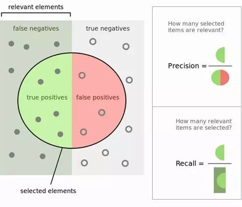
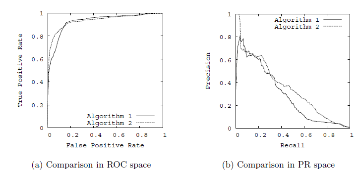

# 精确率与召回率，RoC 曲线与 PR 曲线

## TP, FP, TN, FN

1. True Positives,TP：预测为正样本，实际也为正样本的特征数
2. False Positives,FP：预测为正样本，实际为负样本的特征数
3. True Negatives,TN：预测为负样本，实际也为负样本的特征数
4. False Negatives,FN：预测为负样本，实际为正样本的特征数

图如下所示，里面绿色的半圆就是 TP(True Positives), 红色的半圆就是 FP(False Positives), 左边的灰色长方形（不包括绿色半圆），就是 FN（False Negatives）。右边的 浅灰色长方形（不包括红色半圆），就是 TN(True Negatives)。这个绿色和红色组成的圆内代表我们分类得到模型结果认为是正值的样本。

## 精确率 (precision), 召回率 (Recall) 与特异性 (specificity)

精确率（Precision）的定义在上图可以看出，是绿色半圆除以红色绿色组成的圆。严格的数学定义如下：

$$
P = \frac{TP}{TP + FP}
$$

召回率 (Recall) 的定义也在图上能看出，是绿色半圆除以左边的长方形。严格的数学定义如下：

$$
R = \frac{TP}{TP + FN}
$$

特异性 (specificity) 的定义图上没有 R 接写明，这里给出，是右边长方形去掉红色半圆部分后除以右边的长方形。严格的数学定义如下：

$$
S = \frac{TN}{FP+TN}
$$

有时也用一个 $F1$ 值来综合评估精确率和召回率，它是精确率和召回率的调和均值。当精确率和召回率都高时，$F1$值也会高。严格的数学定义如下：

$$
\frac{2}{F_1} = \frac{1}{P} + \frac{1}{R}
$$

有时候我们对精确率和召回率并不是一视同仁，比如有时候更加重视精确率。我们用一个参数 $\beta$ 来度量两者之间的关系。如果 $\beta>1$，召回率有更大影响，如 $\beta<1$，精确率有更大影响。自然，当 $\beta=1$ 的时候，精确率和召回率影响力相同，和 $F1$ 形式一样。含有度量参数 $\beta$ 的 $F1$ 我们记为 $F_\beta$，严格的数学定义如下：

$$
F_\beta = \frac{(1+\beta^2)\times P\times R}{\beta^2\times P+R}
$$

此外还有灵敏度 (true positive rate ,TPR)，它是所有实际正例中，正确识别的正例比例，它和召回率的表达式没有区别。严格的数学定义如下：

$$
TPR = \frac{TP}{TP + FN}
$$

另一个是 1-特异度 (false positive rate, FPR)，它是实际负例中，错误得识别为正例的负例比例。严格的数学定义如下：

$$
FPR = \frac{FP}{FP + TN}
$$

## RoC 曲线和 PR 曲线

有了上面精确率， 召回率和特异性的基础，理解 RoC 曲线和 PR 曲线就小菜一碟了。

以 TPR 为 y 轴，以 FPR 为 x 轴，我们就直接得到了 RoC 曲线。从 FPR 和 TPR 的定义可以理解，TPR 越高，FPR 越小，我们的模型和算法就越高效。也就是画出来的 RoC 曲线越靠近左上越好。如下图左图所示。从几何的角度讲，RoC 曲线下方的面积越大越大，则模型越优。所以有时候我们用 RoC 曲线下的面积，即 AUC（Area Under Curve）值来作为算法和模型好坏的标准。

以精确率为 y 轴，以召回率为 x 轴，我们就得到了 PR 曲线。仍然从精确率和召回率的定义可以理解，精确率越高，召回率越高，我们的模型和算法就越高效。也就是画出来的 PR 曲线越靠近右上越好。如上图右图所示。

使用 RoC 曲线和 PR 曲线，我们就能很方便的评估我们的模型的分类能力的优劣了。