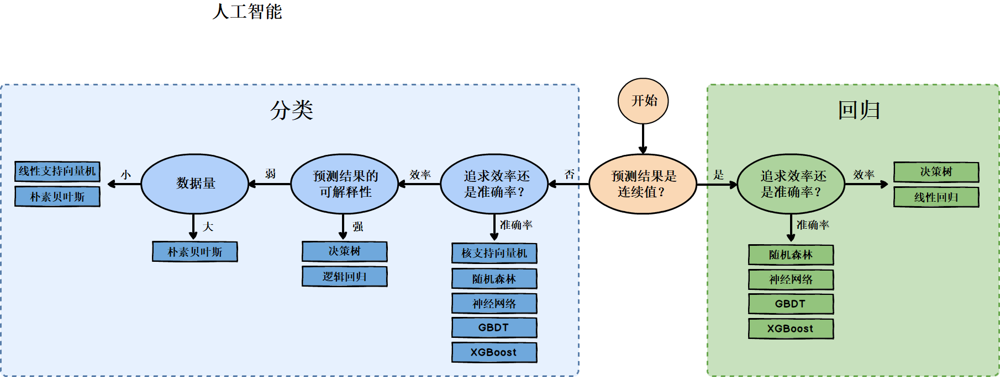
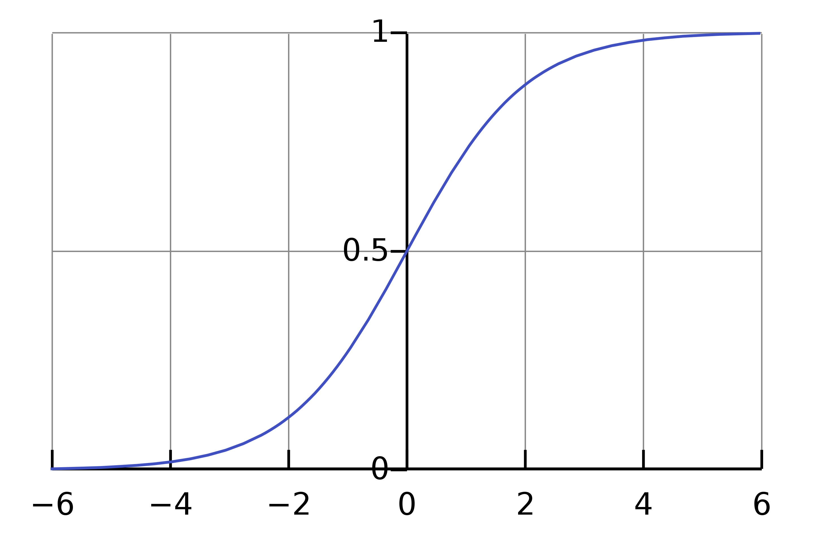

# 机器学习

一个程序被认为能从经验 E 中学习，解决任务 T，达到性能度量值 P，当且仅当，有了经验 E 后，经过 P 评判，程序在处理 T 时的性能有所提升。

# 监督学习

监督学习指的就是我们给学习算法一个数据集。这个数据集由“正确答案”组成。

<div align=center></div>

## 回归

试着推测出一个连续值的结果。

### 单变量线性回归 (Linear Regression with One Variable, Univariate linear regression)

$m$ 代表训练集中实例的数量

$x$ 代表特征/输入变量

$y$ 代表目标变量/输出变量

$(x,y)$ 代表训练集中的实例

$(x^{(i)},y^{(i)})$ 代表第 $i$ 个观察实例

$h$ 代表学习算法的解决方案或函数也称为假设（**hypothesis**）

$$
h_{\theta}(x) = \theta_0+\theta_1x
$$

接下来为模型选择合适的**参数**（**parameters**）$\theta_0$和$\theta_1$

目标是选择出可以使得建模误差的平方和能够最小的模型参数。 即使得代价函数

$$
J(\theta_0,\theta_1) = \frac{1}{2m}\sum\limits_{i = 1}^{m}(h_\theta(x^{(i)}) - y^{(i)})^2
$$

最小，即 $\min \limits_{\theta_0,\theta_1}{J(\theta_0,\theta_1)}$。

#### 代价函数（平方误差函数）

误差平方代价函数，对于大多数问题，特别是回归问题，都是一个合理的选择。还有其他的代价函数也能很好地发挥作用，但是平方误差代价函数可能是解决回归问题最常用的手段了。

对于 $h_\theta(x)$, 如果 $\theta_0,\theta_1$ 固定，$h_\theta(x)$ 是关于 $x$ 的函数，而代价函数 $J(\theta_0,\theta_1)$ 是关于 $\theta_0,\theta_1$ 的函数。

#### 梯度下降

梯度下降是用来求函数最小值的算法，使用梯度下降算法来求出代价函数 $J(\theta_0,\theta_1)$ 的最小值。

时随机选择一个参数的组合 $(\theta_0,\theta_1,...,\theta_n)$ ，计算代价函数，然后寻找下一个能让代价函数值下降最多的参数组合。持续这么做直到一个局部最小值（**local minimum** ），因为并没有尝试完所有的参数组合，所以不能确定得到的局部最小值是否便是全局最小值（**global minimum**），选择不同的初始参数组合，可能会找到不同的局部最小值。

$$
\theta_{j}:=\theta_{j}-\alpha \frac{\partial}{\partial \theta_{j}} J\left(\theta_{0}, \theta_{1}\right) \quad (\text { for } j=0 \text { and } j=1))
$$

$\alpha$ 是学习率（**learning rate** ），决定沿着能让代价函数下降程度最大的方向向下迈出的步子有多大，在批量梯度下降中，每一次都同时让所有的参数减去学习速率乘以代价函数的导数。

Simultaneous update，同时更新 $\theta_0$ 和 $\theta_1$。

$\theta_{0}:=\theta_{0}$，并更新 $\theta_{1}:=\theta_{1}$。

$$
\begin{gathered}
temp\text{ }0:=\theta_{0} - \alpha \frac{\partial}{\partial \theta_{0}} J(\theta_{0}, \theta_{1}) \\ temp\text{ }1:=\theta_{1} - \alpha \frac{\partial}{\partial \theta_{1}} J(\theta_{0}, \theta_{1})\\ \theta_{0}:=temp\text{ }0 \\ \theta_{1}:=temp\text{ }1
\end{gathered}
$$

#### 学习率 $\alpha$

如果学习率太小，就只能一点点地挪动，需要很多步才能到达最低点。如果 $\alpha$ 太大，那么梯度下降法可能会越过最低点，甚至可能无法收敛。

即使学习率 $\alpha$ 保持不变时，梯度下降也可以收敛到局部最低点。在梯度下降法中，当接近局部最低点时，在局部最低时导数接近零，梯度下降法会自动采取更小的幅度，实际上没有必要再另外减小 $\alpha$。

通常可以考虑尝试学习率：$\alpha = 0.01, 0.03, 0.1, 0.3, 1, 3, 10$

$$
\frac{\partial}{\partial \theta_{j}} J(\theta_0,\theta_1) = \frac{\partial}{\partial \theta_{j}} \frac{1}{2m} \sum\limits_{i=1}^{m} (h_\theta(x^{(i)})-y^{(i)})^2 \\
j=0 \text{ 时}：\frac{\partial}{\partial \theta_{0}} J(\theta_0,\theta_1) = \frac{1}{m} \sum\limits_{i=1}^{m} (h_\theta(x^{(i)})-y^{(i)}) \\
j=1 \text{ 时}：\frac{\partial}{\partial \theta_{1}} J(\theta_0,\theta_1) = \frac{1}{m} \sum\limits_{i=1}^{m} ((h_\theta(x^{(i)})-y^{(i)})\cdot{x^{(i)}})
$$

则算法改写成：

Repeat until convergence{

$\theta_0 := \theta_{0} - \alpha \frac{1}{m}\sum\limits_{i=1}^{m} (h_\theta(x^{(i)})-y^{(i)})$

$\theta_1 := \theta_{1} - \alpha \frac{1}{m} \sum\limits_{i=1}^{m} ((h_\theta(x^{(i)})-y^{(i)})\cdot{x^{(i)}})$
}

**批量梯度下降**，指的是在梯度下降的每一步中，都用到了所有的训练样本，在梯度下降中，在计算微分求导项时，需要进行求和运算，所以，在每一个单独的梯度下降中，最终都要计算这样一个东西，这个项需要对所有训练样本 $m$ 求和。

### 多变量线性回归 (Linear Regression with Multiple Variables)

$x^{(i)}_j$ 代表特征矩阵中第 $i$ 行的第 $j$ 个特征，也就是第 $i$ 个训练实例的第 $j$ 个特征。

这个公式中有 $n+1$ 个参数和 $n$ 个变量，为了使得公式能够简化一些，引入 $x_0=1$，则公式转化为：

$$
h_\theta(x)=\theta_0x_0+\theta_1x_1+ \cdots +\theta_nx_n
$$

此时模型中的参数是一个 $n+1$ 维的向量，任何一个训练实例也都是 $n+1$ 维的向量，特征矩阵 $X$ 的维度是 $m\times(n+1)$。 因此公式可以简化为：$h_\theta(x)=\theta^TX$

#### 多变量梯度下降

代价函数：$J(\theta_0,\theta_1,...,\theta_n) = \frac{1}{2m}\sum\limits_{i = 1}^{m}(h_\theta(x^{(i)}) - y^{(i)})^2$

Repeat{

$\theta_j := \theta_{j} - \alpha \frac{1}{m}\sum\limits_{i=1}^{m} ((h_\theta(x^{(i)})-y^{(i)})\cdot x_j^{(i)})$

(simultaneously update $\theta_j$ for $j = 0,1,\cdots,n$

}

计算$J(\theta)$:

```python
def computeCost(X, y, theta):
    inner = np.power(((X * theta.T) - y), 2)
    return np.sum(inner) / (2 * len(X))
```

#### 特征缩放 Feature Scaling

对于多维特征问题，要保证这些特征都具有相近的尺度，帮助梯度下降算法更快地收敛。尝试将所有特征的尺度都尽量缩放到 -1 到 1 之间。

归一化 (Normalization)：将一列数据变化到某个固定区间（范围）中，通常，这个区间是 [0, 1]，广义的讲，可以是各种区间，比如映射到 [0，1] 一样可以继续映射到其他范围，图像中可能会映射到 [0,255]，其他情况可能映射到 [-1,1]；

1. min-max 归一化 $x_n = \frac{x_n-min(x)}{max(x)-min(x)}$，缩放到 0 和 1 之间，但没有改变数据分布
2. mean 归一化 $x_n = \frac{x_n-mean(x)}{max(x)-min(x)}$，缩放到 -1 和 1 之间。

标准化 (Standardization)：将数据变换为均值为 0，标准差为 1 的分布切记，并非一定是正态的；

$x_n = \frac{x_n-\mu_n}{s_n}$，其中 $\mu_n$ 是平均值，$s_n$ 是标准差。

#### 多项式回归 Polynomial Regression

线性回归并不适用于所有数据，有时需要曲线来适应我们的数据，比如一个二次方模型：$h_{\theta}(x) = \theta_0+\theta_1x+\theta_2x_2^2$ 或者三次方模型：$h_{\theta}(x) = \theta_0+\theta_1x+\theta_2x_2^2+\theta_3x_3^3$

令 $x_2 = x_2^2,x_3 = x_3^3$，从而将模型转化为多元线性回归模型。

另外，根据函数图形特性，还可以使用：

$$
h_{\theta}(x) = \theta_0+\theta_1x+\theta_2x_2^2
$$

$$
h_{\theta}(x) = \theta_0+\theta_1x+\theta_2\sqrt{x_2}
$$

注：如果采用多项式回归模型，在运行梯度下降算法前，特征缩放非常有必要！

#### 正规方程 Normal Equation

到目前为止，我们都在使用梯度下降算法，但是对于某些线性回归问题，正规方程方法是更好的解决方案。

正规方程是通过求解 $\frac{\partial}{\partial \theta_j}J(\theta_j)=0$ 来找出使得代价函数最小的参数的。

假设训练集特征矩阵为 $X_{m\times (n+1)}$ （包含了$x_0=1$)，利用正规方程解出向量 $\theta = (X^TX)^{-1}X^Ty$

$x^{(i)} = \left[ \begin{matrix} x_0^{(i)} \\ x_1^{(i)} \\ x_2^{(i)} \\ \vdots \\ x_n^{(i)}\end{matrix} \right] \in \mathbb{R}^{n+1}$

$X = \left [\begin{matrix} ——(x^{(1)})^T—— \\ ——(x^{(2)})^T—— \\ \vdots \\ ——(x^{(m)})^T—— \end{matrix} \right]_{m\times(n+1)}$

$y = \left[ \begin{matrix} y^{(1)} \\ y^{(2)} \\  \vdots \\ y^{(m)}\end{matrix} \right] \in \mathbb{R}^{m}$

注：正规方程不需要特征缩放！

梯度下降：

- 需要选择学习率 $\alpha$，即需要运行多次，尝试不同的学习率，找到效率最好的
- 需要多次迭代
- 当特征数量 $n$ 大时也能较好适用
- 适用于各种类型的模型

正规方程

- 不需要学习率
- 不需要迭代，一次运算得出
- 需要计算 $(X^TX)$，如果特征数量 $n$ 较大则运算代价大，因为矩阵逆的计算时间复杂度为 $O(n^3)$，通常来说当 $n$ 小于 10000 时还是可以接受的
- 只适用于线性模型，不适合逻辑回归模型等其他模型

正规方程

```python
import numpy as np
def normalEqn(X, y):
   theta = np.linalg.inv(X.T@X)@X.T@y #X.T@X 等价于 X.T.dot(X)
   return theta
```

#### 正规方程在不可逆性情况下解决方法

原因：

1. 特征多余，其中的某些特征线性相关。解决方法：删除线性相关的特征。
2. 特征过多，$m \leq n$。解决方法：删除一些特征，或者正则化。

#### 正规方程推导

$$
J(\theta_0,\theta_1) = \frac{1}{2m}\sum\limits_{i = 1}^{m}(h_\theta(x^{(i)}) - y^{(i)})^2
$$

其中：

$$
h_\theta(x)=\theta_0x_0+\theta_1x_1+...+\theta_nx_n
$$

将向量表达形式转为矩阵表达形式，则有 $J(\theta_0,\theta_1) = \frac{1}{2}(X\theta-y)^2$，其中 $X$ 为 $m$ 行 $n$ 列的矩阵（$m$ 为样本个数，$n$为特征个数），$\theta$ 为 $n$ 行 1 列的矩阵，$y$ 为 $m$ 行 1 列的矩阵，对 $J(\theta)$ 进行如下变换：

$$
\begin{aligned}
J(\theta) &= \frac{1}{2}(X\theta-y)^T(X\theta-y) \\
&= \frac{1}{2}(\theta^TX^T-y^T)(X\theta-y) \\
&= \frac{1}{2}(\theta^TX^TX\theta-\theta^TX^Ty-y^TX\theta-y^Ty)
\end{aligned}
$$

接下来对 $J(\theta)$ 偏导，需要用到以下几个矩阵的求导法则：

1. $\frac{dAB}{dB}=A^T$
2. $\frac{dX^TAX}{dX}=2AX$

$$
\frac{\partial J(\theta)}{\partial\theta} = \frac{1}{2}(2X^TX\theta-2X^Ty-0)=(X^TX\theta-X^Ty)
$$

令 $J(\theta)=0$，有：

$$
θ=(XTX)−1XTy\theta = (X^TX)^{-1}X^Ty
$$

### 分类（逻辑回归）

试着推测出离散的输出值

要预测的变量 $y$ 是离散的值，使用逻辑回归 (**Logistic Regression**) 的算法，这是目前最流行使用最广泛的一种学习算法。

将因变量 (**dependent variable**) 可能属于的两个类分别称为负向类（**negative class**）和正向类（**positive class**），则因变量 $y \in 0,1$，其中 0 表示负向类，1 表示正向类。

逻辑回归，该模型的输出变量范围始终在 0 和 1 之间。

逻辑回归模型的假设是：$h_\theta(x)=g(\theta^Tx)$，其中：$x$ 代表特征向量。 $g$ 代表逻辑函数（**logistic function**) 是一个常用的逻辑函数为 **S** 形函数（**Sigmoid function**），公式为：$g(z)=\frac{1}{1+e^{-z}}$

$$
h_\theta(x)=\frac{1}{1+e^{-\theta^Tx}}
$$

```python
import numpy as np
def sigmoid(z):
   return 1 / (1 + np.exp(-z))
```

$h_\theta(x)$的作用是，对于给定的输入变量，根据选择的参数计算输出变量=1 的可能性（**estimated probablity**）即 $h_\theta(x)=P(y=1\mid x;\theta)$，例如，如果对于给定的 $x$，通过已经确定的参数计算得出 $h_\theta(x)=0.7$，则表示有 70%的几率为 $y$ 正向类，相应地为 $y$ 负向类的几率为 1-0.7=0.3。

#### 决策边界 decision boundary

<div align=center></div>

$z= \theta^Tx \geq 0, h_\theta(x)\geq 0.5$，此时预测 $y=1$

$z= \theta^Tx < 0, h_\theta(x)< 0.5$，此时预测 $y=0$

现在假设我们有一个模型：并且参数 $\theta$ 是向量 [-3 1 1]。 则当 $-3+{x_1}+{x_2} \geq 0$，即 ${x_1}+{x_2} \geq 3$ 时，模型将预测 $y=1$。

绘制直线 ${x_1}+{x_2} = 3$，这条线便是我们模型的分界线，对应 $h_\theta(x)=0.5$，将预测为 1 的区域和预测为 0 的区域分隔开。

不是用训练集来定义决策边界，而是用训练集来拟合参数 $\theta$，一旦有了参数 $\theta$，就确定了决策边界。

#### 代价函数

Training Set:$\{ (x^{(1)},y^{(1)}),(x^{(2)},y^{(2)}),\dots ,(x^{(m)},y^{(m)})\}$

$m$ examples: $x \in \left[ \begin{matrix}  x_0 \\ x_1 \\  \vdots \\ x_n \end{matrix} \right] \in \mathbb{R}^{n+1}$, $x_0=1$, $y\in \{0,1\}$

$$
h_\theta(x)=\frac{1}{1+e^{-\theta^Tx}}
$$

代价函数：

$$
J(\theta)=\frac{1}{m}\sum\limits_{i=1}^{m}{Cost\left(h_\theta(x^{(i)} ),y^{(i)} \right)}
$$

其中

$$
Cost(h_{\theta}(x), y)=\left\{\begin{array}{ll}
-\log(h_{\theta}(x)) & \text { if } y=1  \\
-\log (1-h_{\theta}(x)) & \text { if } y=0
\end{array}\right.
$$

当实际的 $y=1$ 且 $h_\theta(x)$ 也为 1 时误差为 0，当 $y=1$ 但 $h_\theta(x)$ 不为 1 时误差随着 $h_\theta(x)$ 变小而变大；

当实际的 $y=0$ 且 $h_\theta(x)$ 也为 0 时代价为 0，当 $y=0$ 但 $h_\theta(x)$ 不为 0 时误差随着 $h_\theta(x)$ 变大而变大。

将构建的 $Cost(h_\theta(x),y)$ 简化如下：

$$
Cost(h_\theta(x),y)=-y\times log(h_\theta(x))-(1-y)\times log( 1-h_\theta(x))
$$

带入代价函数得到：

$$
J(\theta)= \frac{1}{m}\sum\limits_{i=1}^{m}{\left[-{y^{(i)}}\log \left(h_\theta(x^{(i)}) \right)-\left( 1-{y^{(i)}} \right)\log \left( 1-{h_\theta}(x^{(i)}) \right)\right]}
$$

即：

$$
J\left( \theta  \right)=-\frac{1}{m}\sum\limits_{i=1}^{m}{\left[{y^{(i)}}\log \left( h_\theta(x^{(i)}) \right)+\left( 1-{y^{(i)}} \right)\log \left( 1-h_\theta(x^{(i)}) \right)\right]}
$$

（统计学中的极大似然法）

在得到这样一个代价函数以后，我们便可以用梯度下降算法来求得能使代价函数最小的参数了。算法为：

$$
\min\limits_\theta J(\theta)
$$

Repeat:{
$\theta_j := \theta_j - \alpha \frac{\partial}{\partial\theta_j} J(\theta)$
(simultaneously update all)
}

求导后得到：

Repeat: {
$\theta_j := \theta_j - \alpha \frac{1}{m}\sum\limits_{i=1}^{m}{ {\left( {h_\theta}\left( \mathop{x}^{\left( i \right)} \right)- \mathop{y}^{\left( i \right)} \right)}} \mathop{x}_{j}^{(i)}$
(simultaneously update all)
}

推导：

$$
{h_\theta}\left( {x^{(i)}} \right)=\frac{1}{1+{e^{-{\theta^T}{x^{(i)}}}}}
$$

则：

$$
\begin{aligned}
& y^{(i)} \log \left(h_{\theta}\left(x^{(i)}\right)\right)+\left(1-y^{(i)}\right) \log \left(1-h_{\theta}\left(x^{(i)}\right)\right) \\
=& y^{(i)} \log \left(\frac{1}{1+e^{-\theta^{T} x^{(i)}}}\right)+\left(1-y^{(i)}\right) \log \left(1-\frac{1}{1+e^{-\theta^{T} x^{(i)}}}\right) \\
=&-y^{(i)} \log \left(1+e^{-\theta^{T} x^{(i)}}\right)-\left(1-y^{(i)}\right) \log \left(1+e^{\theta^{T} x^{(i)}}\right)
\end{aligned}
$$

所以：

$$
\begin{aligned}
\frac{\partial }{\partial {\theta_{j}}}J\left( \theta  \right)&=\frac{\partial }{\partial {\theta_{j}}}\{-\frac{1}{m}\sum\limits_{i=1}^{m}{[-{y^{(i)}}\log \left( 1+{e^{-{\theta^{T}}{x^{(i)}}}} \right)-\left( 1-{y^{(i)}} \right)\log \left( 1+{e^{\theta^{T}{x^{(i)}}}} \right)]}\} \\ &=-\frac{1}{m}\sum\limits_{i=1}^{m}{[-{y^{(i)}}\frac{-x_{j}^{(i)}{e^{-{\theta^{T}}{x^{(i)}}}}}{1+{e^{-{\theta^{T}}{x^{(i)}}}}}-\left( 1-{y^{(i)}} \right)\frac{x_j^{(i)}{e^{\theta^T{x^{(i)}}}}}{1+{e^{\theta^T{x^{(i)}}}}}}] \\ &=-\frac{1}{m}\sum\limits_{i=1}^{m}{y^{(i)}}\frac{x_j^{(i)}}{1+{e^{\theta^T{x^{(i)}}}}}-\left( 1-{y^{(i)}} \right)\frac{x_j^{(i)}{e^{\theta^T{x^{(i)}}}}}{1+{e^{\theta^T{x^{(i)}}}}}] \\ &=-\frac{1}{m}\sum\limits_{i=1}^{m}{\frac{y^{(i)}x_j^{(i)}-x_j^{(i)}{e^{\theta^T{x}^{(i)}}}+{y^{(i)}}x_j^{(i)}{e^{\theta^T{x^{(i)}}}}}{1+{e^{\theta^T{x^{(i)}}}}}}  \\ &=-\frac{1}{m}\sum\limits_{i=1}^{m}{\frac{y^{(i)}\left( 1\text{+}{e^{\theta^T{x^{(i)}}}} \right)-{e^{\theta^T{x^{(i)}}}}}{1+{e^{\theta^T{x^{(i)}}}}}x_j^{(i)}} \\ &=-\frac{1}{m}\sum\limits_{i=1}^{m}{({y^{(i)}}-\frac{e^{\theta^T{x^{(i)}}}}{1+{e^{\theta^T{x^{(i)}}}}})x_j^{(i)}} \\ &=-\frac{1}{m}\sum\limits_{i=1}^{m}{({y^{(i)}}-\frac{1}{1+{e^{-{\theta^T}{x^{(i)}}}}})x_j^{(i)}} \\ &=-\frac{1}{m}\sum\limits_{i=1}^{m}{[{y^{(i)}}-{h_\theta}\left( {x^{(i)}} \right)]x_j^{(i)}} \\ &=\frac{1}{m}\sum\limits_{i=1}^{m}{[{h_\theta}\left( {x^{(i)}} \right)-y^{(i)}]x_j^{(i)}}
\end{aligned}
$$

**补充：**

$$
P\left( y=1\mid x;\theta \right)=h_\theta \left( x \right)
$$

$$
P\left( y=0\mid x;\theta \right)= 1 - h_\theta \left( x \right)
$$

上面两式可以写成一般形式

$$
P\left( y\mid x;\theta \right)= (h_\theta \left( x \right))^y (1 - h_\theta \left( x \right))^{1-y}
$$

接下来我们就要用极大似然估计来根据给定的训练集估计出参数 $\theta$。

$$
L(\theta) = \prod \limits_{i=1}^{n}P(y^{(i)}\mid x^{(i)};\theta)=\prod \limits_{i=1}^{n}(h_\theta ( x^{(i)} ))^{y^{(i)}} (1 - h_\theta(x^{(i)} )^{1-y^{(i)}}
$$

两边取对数：

$$
l(\theta)=ln L(\theta)=\sum \limits_{i=1}^{n}y^{(i)} ln(h_\theta ( x^{(i)} )) + (1-y^{(i)}) ln(1 - h_\theta(x^{(i)})
$$

要求使得 $l(\theta)$ 最大的 $\theta$，加上负号，即为使代价函数最小。

$$
J(\theta)=-l(\theta)=-\sum \limits_{i=1}^{n}(y^{(i)} ln(h_\theta ( x^{(i)} )) + (1-y^{(i)}) ln(1 - h_\theta(x^{(i)}))$$

Sigmoid function 有一个很好的性质是

$$
\phi(z)=\frac{1}{1+e^{(-z)}}$$

$$
\phi(z)^{'} = \phi(z)(1-\phi(z))$$

$$
\begin{aligned} \frac{\partial }{\partial {\theta_{j}}}J(\theta) &=-\sum\limits_{i=1}^{m}{({y^{(i)}}\frac{1}{\phi(z^{(i)})}-( 1-{y^{(i)}})\frac{1}{1-\phi(z^{(i)})}}) \frac{\partial{\phi(z^{(i)})}}{\partial{\theta_j}} \\  &= -\sum\limits_{i=1}^{m}({y^{(i)}\frac{1}{\phi(z^{(i)})}-( 1-{y^{(i)}})\frac{1}{1-\phi(z^{(i)})}})\phi({z^{(i)}})(1-\phi({z^{(i)}}) \frac{\partial z^{(i)}}{\partial\theta} \\ &= -\sum\limits_{i=1}^{m} (y^{(i)}(1-\phi({z^{(i)}})-(1-y^{(i)})\phi({z^{(i)}})){x^{(i)}} \\ &=-\sum \limits_{i=1}^{m}(y^{(i)}-\phi({z^{(i)}}))x^{(i)} \\ &=-\sum \limits_{i=1}^{m}(y^{(i)}-\phi({z^{(i)}}))x^{(i)} \\ &=\sum\limits_{i=1}^{m}{({h_\theta}\left( {x^{(i)}} \right)-{y^{(i)}})x_j^{(i)}} \end{aligned}
$$

注：虽然得到的梯度下降算法表面上看上去与线性回归的梯度下降算法一样，但是这里的 $h_\theta(x^{(i)})=g(\theta^TX)$ 与线性回归中不同，所以实际上是不一样的。另外，在运行梯度下降算法之前，进行特征缩放依旧是非常必要的。

一些梯度下降算法之外的选择：  
除了梯度下降算法以外，还有一些常被用来令代价函数最小的算法，这些算法更加复杂和优越，而且通常不需要人工选择学习率，通常比梯度下降算法要更加快速。这些算法有：**共轭梯度**（**Conjugate Gradient**），**局部优化法** (**Broyden fletcher goldfarb shann,BFGS**) 和**有限内存局部优化法** (**LBFGS**)。

这三种算法有许多优点：

1. 通常不需要手动选择学习率 $\alpha$，所以对于这些算法的一种思路是，给出计算导数项和代价函数的方法，你可以认为算法有一个智能的内部循环，而且，事实上，他们确实有一个智能的内部循环，称为**线性搜索** (**line search**) 算法，它可以自动尝试不同的学习速率 $\alpha$，并自动选择一个好的学习速率 $\alpha$，甚至可以为每次迭代选择不同的学习速率，不需要自己选择。
2. 比梯度下降收敛得快得多

缺点：更复杂

#### 多类别分类：一对多

将多个类中的一个类标记为正向类（$y=1$），然后将其他所有类都标记为负向类，这个模型记作 $h_\theta^{\left( 1 \right)}\left( x \right)$。接着，类似地选择另一个类标记为正向类（$y=2$），再将其它类都标记为负向类，将这个模型记作 $h_\theta^{\left( 2 \right)}\left( x \right)$，依此类推。

最后得到一系列模型简记为： $h_\theta^{\left( i \right)}\left( x \right)=p\left( y=i\mid x;\theta  \right)$其中：$i=\left( 1,2,3....k \right)$

最后，在需要做预测时，将所有的分类机都运行一遍，然后对每一个输入变量，都选择最高可能性的输出变量。

总之，就是训练这个逻辑回归分类器：$h_\theta^{\left( i \right)}\left( x \right)$， 其中 $i$ 对应每一个可能的 $y=i$，最后，输入一个新的 $x$ 值用来做预测。要做的就是在所有分类器里面输入 $x$，然后选择一个让 $h_\theta^{\left( i \right)}\left( x \right)$ 最大的 $i$，即 $\mathop{\max}\limits_i\,h_\theta^{\left( i \right)}\left( x \right)$。

### 正则化

#### 过拟合 Overfitting

1. 欠拟合：Underfitting，bias 偏差较高
2. 过拟合：Overfitting，variance 方差较高，代价函数很小甚至为 0，泛化能力很差

解决：

1. 丢弃一些不能帮助我们正确预测的特征。可以是手工选择保留哪些特征，或者使用一些模型选择的算法来帮忙（例如 **PCA**）
2. 正则化：保留所有的特征，但是减少参数的大小（**magnitude**）。

$$
J(\theta)=\frac{1}{2m}\left[\sum\limits_{i=1}^{m}{(h_\theta(x^{(i)})-y^{(i)})}^2+\lambda \sum\limits_{j=1}^{n}\theta_{j}^{2}\right]$$

其中 $\lambda$ 又称为正则化参数（**Regularization Parameter**）。 注：根据惯例，不对 ${\theta_{0}}$ 进行惩罚。

如果选择的正则化参数 $\lambda$ 过大，则会把所有的参数都最小化了，导致模型变成 ${h_\theta}\left( x \right)={\theta_{0}}$，造成欠拟合。

#### 线性回归正则化

$$
J\left( \theta  \right)=\frac{1}{2m}\sum\limits_{i=1}^{m}\left[({(h_\theta(x^{(i)})-{y^{(i)}})}^{2}+\lambda \sum\limits_{j=1}^{n}{\theta _{j}^{2}})\right]
$$

Repeat until convergence{

${\theta_0}:={\theta_0}-\alpha \frac{1}{m}\sum\limits_{i=1}^{m}{(({h_\theta}({x^{(i)}})-{y^{(i)}})x_{0}^{(i)}})$

${\theta_j}:={\theta_j}-\alpha[\frac{1}{m}\sum\limits_{i=1}^{m}{(({h_\theta}({x^{(i)}})-{y^{(i)}})x_{j}^{\left( i \right)}}+\frac{\lambda }{m}{\theta_j}]$  for $j=1,2,...n$

}

只对 $\theta_1,\theta_2,\cdots,\theta_n$ 惩罚，不惩罚 $\theta_0$

对上面的算法中 $j=1,2,...,n$ 时的更新式子进行调整可得：

$$
{\theta_j}:={\theta_j}(1-\alpha\frac{\lambda }{m})- \alpha \frac{1}{m}\sum\limits_{i=1}^{m}{({h_\theta}({x^{(i)}})-{y^{(i)}})x_{j}^{\left( i \right)}}
$$

（$\alpha$ 很小，$m$ 很大，所以 $\alpha \frac{\lambda}{m}$ 非常小）

可以看出，正则化线性回归的梯度下降算法的变化在于，每次都在原有算法更新规则的基础上令 $\theta$ 值减少了一个额外的值，然后进行和之前一样的更新操作。

同样也可以利用正规方程来求解正则化线性回归模型：

$$
\theta=\left(X^{T} X+\lambda\left[\begin{array}{cccc}0 & & & \\ & 1 & & \\ & & 1 & \\ & & & \ddots& \\ & & & & 1\end{array}\right]\right)^{-1} X^{T} y
$$

矩阵尺寸为 $(n+1)\times(n+1)$

不可逆情况讨论：如果 $\lambda>0$，则$\left(X^{T} X+\lambda\left[\begin{array}{cccc}0 & & & \\ & 1 & & \\ & & 1 & \\ & & & \ddots& \\ & & & & 1\end{array}\right]\right)^{-1}$一定可逆

#### 逻辑回归正则化

$$
J\left( \theta  \right)=\frac{1}{m}\sum\limits_{i=1}^{m}{[-{y^{(i)}}\log \left( {h_\theta}\left( {x^{(i)}} \right) \right)-\left( 1-{y^{(i)}} \right)\log \left( 1-{h_\theta}\left( {x^{(i)}} \right) \right)]}+\frac{\lambda }{2m}\sum\limits_{j=1}^{n}{\theta _{j}^{2}}
$$

```python
import numpy as np

def costReg(theta, X, y, lambda):
    theta = np.matrix(theta)
    X = np.matrix(X)
    y = np.matrix(y)
    first = np.multiply(-y, np.log(sigmoid(X*theta.T)))
    second = np.multiply((1 - y), np.log(1 - sigmoid(X*theta.T)))
    reg = (lambda / (2 * len(X))* np.sum(np.power(theta[:,1:theta.shape[1]],2))
    return np.sum(first - second) / (len(X)) + reg
```

Repeat until convergence{

${\theta_0}:={\theta_0}-\alpha \frac{1}{m}\sum\limits_{i=1}^{m}{(({h_\theta}({x^{(i)}})-{y^{(i)}})x_{0}^{(i)}})$

${\theta_j}:={\theta_j}-\alpha[\frac{1}{m}\sum\limits_{i=1}^{m}{(({h_\theta}({x^{(i)}})-{y^{(i)}})x_{j}^{\left( i \right)}}+\frac{\lambda }{m}{\theta_j}]$  for $j=1,2,...n$

}

注：看上去同线性回归一样，但是 ${h_\theta}\left( x \right)=g\left( {\theta^T}X \right)$ 与线性回归 $h_\theta(x)=\theta_0x_0+\theta_1x_1+ \cdots +\theta_nx_n$ 不同，所以与线性回归本质不同。
