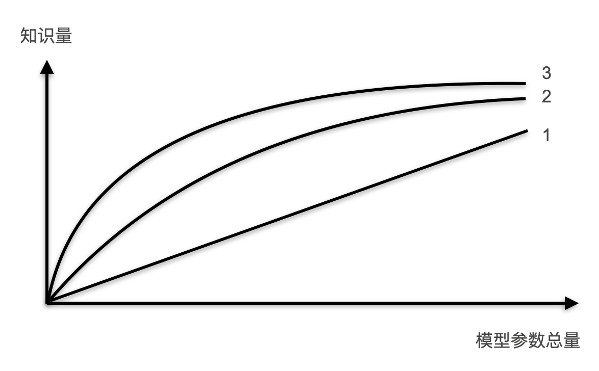
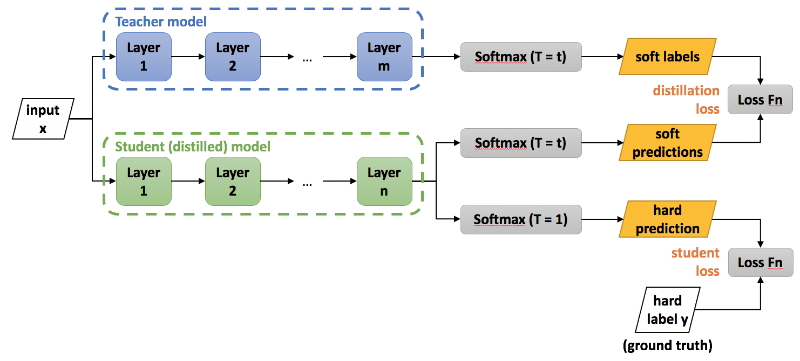
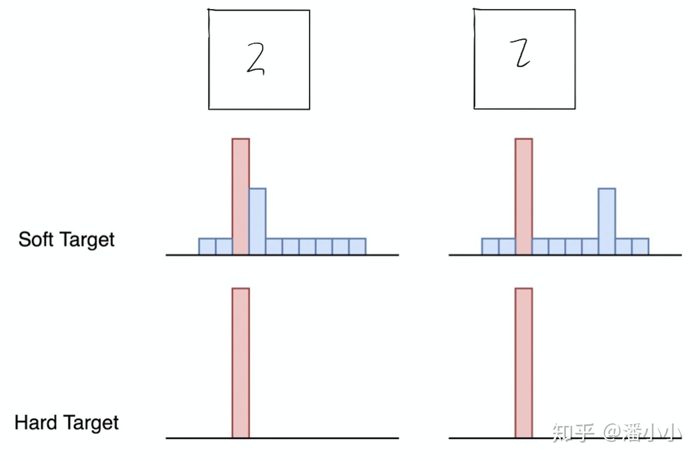

# 知识蒸馏

Knowledge Distillation

[知乎原文：【经典简读】知识蒸馏 (Knowledge Distillation) 经典之作](https://zhuanlan.zhihu.com/p/102038521)

知识蒸馏是一种模型压缩方法，是一种基于“教师-学生网络思想”的训练方法，由于其简单，有效，在工业界被广泛应用。这一技术的理论来自于 2015 年 Hinton 发表的一篇神作：

[Distilling the Knowledge in a Neural Network](https://arxiv.org/pdf/1503.02531.pdf)

Knowledge Distillation，简称 KD，顾名思义，就是将已经训练好的模型包含的知识 (“Knowledge”)，蒸馏 (“Distill”) 提取到另一个模型里面去。今天，我们就来简单读一下这篇论文，力求用简单的语言描述论文作者的主要思想。在本文中，我们将从背景和动机讲起，然后着重介绍“知识蒸馏”的方法，最后我会讨论“温度“这个名词：

- 温度：我们都知道“蒸馏”需要在高温下进行，那么这个“蒸馏”的温度代表了什么，又是如何选取合适的温度

## 1. 介绍

### 1.1 论文提出的背景

虽然在一般情况下，我们不会去区分训练和部署使用的模型，但是训练和部署之间存在着一定的不一致性：

- 在训练过程中，我们需要使用复杂的模型，大量的计算资源，以便从非常大、高度冗余的数据集中提取出信息。在实验中，效果最好的模型往往规模很大，甚至由多个模型集成得到。而大模型不方便部署到服务中去，常见的瓶颈：

1. 推断速度慢
2. 对部署资源要求高（内存，显存等）

- 在部署时，需要对延迟以及计算资源严格的限制。

因此，模型压缩（在保证性能的前提下减少模型的参数量）成为了一个重要的问题。而“模型蒸馏”属于模型压缩的一种方法。

**插句题外话**，我们可以从模型参数量和训练数据量之间的相对关系来理解 underfitting 和 overfitting：

> 模型就像一个容器，训练数据中蕴含的知识就像是要装进容器里的水。当数据知识量（水量）超过模型所能建模的范围时（容器的容积），加再多的数据也不能提升效果（水再多也装不进容器），因为模型的表达空间有限（容器容积有限），就会造成 **underfitting**；而当模型的参数量大于已有知识所需要的表达空间时（容积大于水量，水装不满容器），就会造成 **overfitting**，即模型的 variance 会增大（想象一下摇晃半满的容器，里面水的形状是不稳定的）。

### 1.2 “思想歧路”

上面容器和水的比喻非常经典和贴切，但是会引起一个误解：人们在直觉上会觉得，要保留相近的知识量，必须保留相近规模的模型。也就是说，一个模型的参数量基本决定了其所能捕获到的数据内蕴含的“知识”的量。

这样的想法是基本正确的，但是需要注意的是：

1. 模型的参数量和其所能捕获的“知识“量之间并非稳定的线性关系（下图中的 1)，而是接近边际收益逐渐减少的一种增长曲线（下图中的 2 和 3)。
2. 完全相同的模型架构和模型参数量，使用完全相同的训练数据，能捕获的“知识”量并不一定完全相同，另一个关键因素是训练的方法。合适的训练方法可以使得在模型参数总量比较小时，尽可能地获取到更多的“知识”（下图中的 3 与 2 曲线的对比）。

## 2. 知识蒸馏的理论依据

### 2.1 Teacher Model 和 Student Model

知识蒸馏使用的是 Teacher—Student 模型，其中 teacher 是“知识”的输出者，student 是“知识”的接受者。知识蒸馏的过程分为 2 个阶段：

1. 原始模型训练：训练"Teacher 模型"，简称为 Net-T，它的特点是模型相对复杂，也可以由多个分别训练的模型集成而成。我们对"Teacher 模型"不作任何关于模型架构、参数量、是否集成方面的限制，唯一的要求就是，对于输入 X，其都能输出 Y，其中 Y 经过 softmax 的映射，输出值对应相应类别的概率值。
1. 精简模型训练：训练"Student 模型"，简称为 Net-S，它是参数量较小、模型结构相对简单的单模型。同样的，对于输入 X，其都能输出 Y，Y 经过 softmax 映射后同样能输出对应相应类别的概率值。

在本论文中，作者将问题限定在**分类问题**下，或者其他本质上属于分类问题的问题，该类问题的共同点是模型最后会有一个 softmax 层，其输出值对应了相应类别的概率值。

### 知识蒸馏的关键点

如果回归机器学习最最基础的理论，我们可以很清楚地意识到一点（而这一点往往在我们深入研究机器学习之后被忽略）：**机器学习最根本的目的**在于训练出在某个问题上泛化能力强的模型。

- **泛化能力强**：在某问题的所有数据上都能很好地反应输入和输出之间的关系，无论是训练数据，还是测试数据，还是任何属于该问题的未知数据。
- 而现实中，由于我们不可能收集到某问题的所有数据来作为训练数据，并且新数据总是在源源不断的产生，因此我们只能退而求其次，训练目标变成在已有的训练数据集上建模输入和输出之间的关系。由于训练数据集是对真实数据分布情况的采样，训练数据集上的最优解往往会多少偏离真正的最优解（这里的讨论不考虑模型容量）。

而在知识蒸馏时，由于我们已经有了一个泛化能力较强的 Net-T，我们在利用 Net-T 来蒸馏训练 Net-S 时，可以直接让 Net-S 去学习 Net-T 的泛化能力。

一个很直白且高效的迁移泛化能力的方法就是：使用 softmax 层输出的类别的概率来作为“soft target”。

### “蒸馏器”：softmax 函数

先回顾一下原始的 softmax 函数：

$$q_i=\frac{e^{z_i}}{\sum_je^{z_j}}$$

但要是直接使用 softmax 层的输出值作为 soft target，这又会带来一个问题：当 softmax 输出的概率分布熵相对较小时，负标签的值都很接近 0，对损失函数的贡献非常小，小到可以忽略不计。因此“**温度**”这个变量就派上了用场。

下面的公式时加了温度这个变量之后的 softmax 函数：

$$q_i=\frac{e^{z_i/T}}{\sum_je^{z_j/T}}$$

这里的 T 就是**温度**。
原来的 softmax 函数是 T = 1 的特例。 T 越高，softmax 的 output probability distribution 越趋于平滑，其分布的熵越大，负标签携带的信息会被相对地放大，模型训练将更加关注负标签。

## 3. 知识蒸馏的具体方法

### 3.1 通用的知识蒸馏方法

**第一步**是训练 Net-T；**第二步**是在高温 T 下，蒸馏 Net-T 的知识到 Net-S

训练 Net-T 的过程很简单，下面详细讲讲第二步：高温蒸馏的过程。高温蒸馏过程的目标函数由 distill loss（对应 soft target) 和 student loss（对应 hard target) 加权得到。示意图如上。

$$L=\alpha L_{soft}+\beta L_{hard}$$

- $v_i$：Net-T 的 logits
- $z_i$：Net-S 的 logits
- $p_i^T$：Net-T 的在温度=T 下的 softmax 输出在第 i 类上的值
- $q_i^T$：Net-S 的在温度=T 下的 softmax 输出在第 i 类上的值
- $c_i$：在第 i 类上的 ground truth 值，$c_i\in\{0,1\}$，正标签取 1，负标签取 0.
- $N$：总标签数量

Net-T 和 Net-S 同时输入训练集（这里可以直接复用训练 Net-T 用到的训练集），用 Net-T 产生的 softmax distribution (with high temperature) 来作为 soft target，Net-S 在相同温度 T 条件下的 softmax 输出和 soft target 的 cross entropy 就是 Loss 函数的第一部分$L_{soft}$：

$$L_{soft}=-\sum_j^Np_i^Tlog(q_j^T)$$

其中：

$$p_i=\frac{e^{v_i/T}}{\sum_k^Ne^{v_k/T}}$$

$$q_i=\frac{e^{z_i/T}}{\sum_k^Ne^{z_k/T}}$$

Net-S 在 T=1 的条件下的 softmax 输出和 ground truth 的 cross entropy 就是 Loss 函数的第二部分$L_{hard}$：

$$L_{hard}=-\sum_j^Nc_ilog(q_j^1)$$

其中：

$$q_i^1=\frac{e^{z_i}}{\sum_k^Ne^{z_k}}$$

第二部分 Loss $L_{hard}$ 的必要性其实很好理解：Net-T 也有一定的错误率，使用 ground truth 可以有效降低错误被传播给 Net-S 的可能。打个比方，老师虽然学识远远超过学生，但是他仍然有出错的可能，而这时候如果学生在老师的教授之外，可以同时参考到标准答案，就可以有效地降低被老师偶尔的错误“带偏”的可能性。

### 3.2 一种特殊情形：直接 match logits（不经过 softmax)

直接 match logits 指的是，直接使用 softmax 层的输入 logits（而不是输出）作为 soft targets，需要最小化的目标函数是 Net-T 和 Net-S 的 logits 之间的平方差。

**直接上结论：直接 match logits 的做法是 $T\rightarrow\infin$ 的情况下的特殊情形。**

$$
\frac{\partial L_{soft}}{\partial z_i} = \frac{1}{T}(q_i-p_i) = \frac{1}{T} \left( \frac{e^{z_i/T}}{\sum_j e^{z_j/T}}- \frac{e^{v_i/T}}{\sum_j e^{v_j/T}}\right)
$$

当 $T\rightarrow\infin$ 时，我们使用 $1+x/T$ 来近似 $e^{x/T}$ ，于是得到：

$$ 
\frac{\partial L_{soft}}{\partial z_i} \approx \frac{1}{T} \left( \frac{1+z_i/T}{N + \sum_j z_j/T} - \frac{1+v_i/T}{N + \sum_j v_j/T}\right)
$$

如果再加上 logits 是零均值的假设：

$$\sum_j z_j/T=\sum_j v_j/T=0$$

那么上面的公式可以简化成：

$$\frac{\partial L_{soft}}{\partial z_i} \approx \frac{1}{NT^2}(z_i-v_i)$$

也就是等价于 minimise 下面的损失函数：

$$ L_{soft}' = \frac{1}{2} (z_i-v_i)^2 $$

## 讨论

### KD 的训练过程和传统的训练过程的对比

1. 传统训练过程 (**hard targets**)：对 ground truth 求极大似然
2. KD 的训练过程 (**soft targets**)：用 large model 的 class probabilities 作为 soft targets

### 举个例子

在手写体数字识别任务 MNIST 中，输出类别有 10 个。

假设某个输入的“2”更加形似“3”，softmax 的输出值中"3"对应的概率为 0.1，而其他负标签对应的值都很小，而另一个“2”更加形似“7”，“7”对应的概率为 0.1。这两个“2”对应的 hard target 的值是相同的，但是它们的 soft target 却是不同的，由此我们可见 soft target 蕴含着比 hard target 多的信息。并且 soft target 分布的熵相对高时，其 soft target 蕴含的知识就更丰富。

这就解释了为什么通过蒸馏的方法训练出的 Net-S 相比使用完全相同的模型结构和训练数据只使用 hard target 的训练方法得到的模型，拥有更好的泛化能力。

## 关于"温度"的讨论

【问题】 我们都知道“蒸馏”需要在高温下进行，那么这个“蒸馏”的温度代表了什么，又是如何选取合适的温度？

### 温度的特点

在回答这个问题之前，先讨论一下**温度 $T$ 的特点**

1. 原始的 softmax 函数是 $T=1$ 时的特例，$T<1$ 时，概率分布比原始更“陡峭”，$T>1$ 时，概率分布比原始更“平缓”。
1. 温度越高，softmax 上各个值的分布就越平均（思考极端情况：(i) $T=\infin$，此时 softmax 的值是平均分布的；(ii) $T\rightarrow 0$，此时 softmax 的值就相当于 argmax，即最大的概率处的值趋近于 1，而其他值趋近于 0）
1. 不管温度 T 怎么取值，Soft target 都有忽略相对较小的 $p_i$ 携带的信息的倾向

### 温度代表了什么，如何选取合适的温度？

**温度的高低改变的是 Net-S 训练过程中对负标签的关注程度**：温度较低时，对负标签的关注，尤其是那些显著低于平均值的负标签的关注较少；而温度较高时，负标签相关的值会相对增大，Net-S 会相对多地关注到负标签。

实际上，负标签中包含一定的信息，尤其是那些值显著**高于**平均值的负标签。但由于 Net-T 的训练过程决定了负标签部分比较 noisy，并且负标签的值越低，其信息就越不可靠。因此温度的选取比较 empirical，本质上就是在下面两件事之中取舍：

1. 从有部分信息量的负标签中学习 -> 温度要高一些
1. 防止受负标签中噪声的影响 ->温度要低一些

总的来说，T 的选择和 Net-S 的大小有关，Net-S 参数量比较小的时候，相对比较低的温度就可以了（因为参数量小的模型不能 capture all knowledge，所以可以适当忽略掉一些负标签的信息）