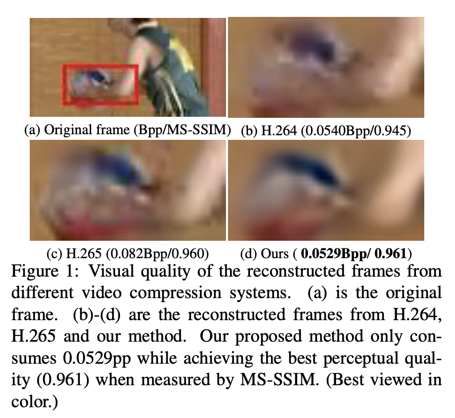
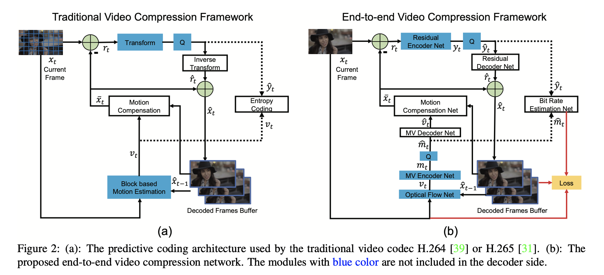
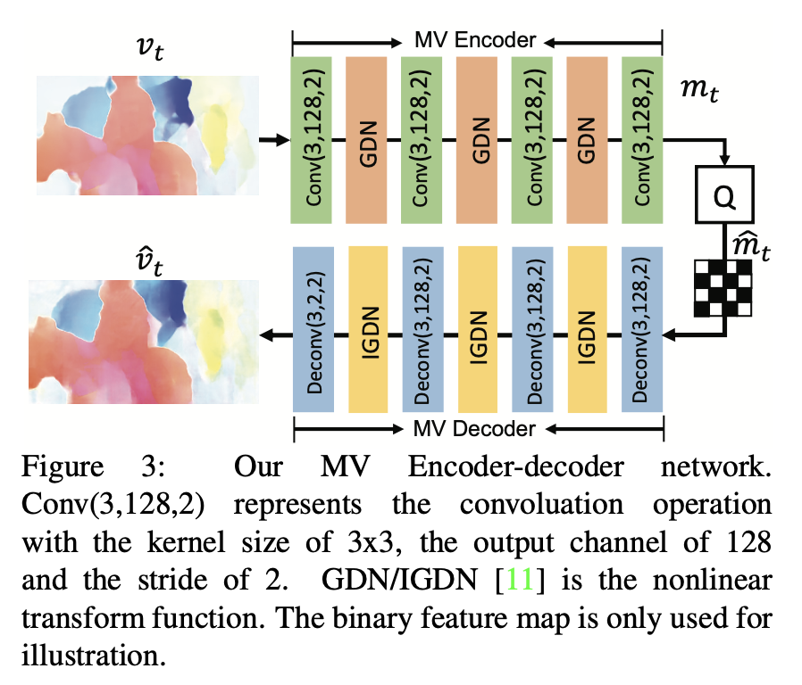
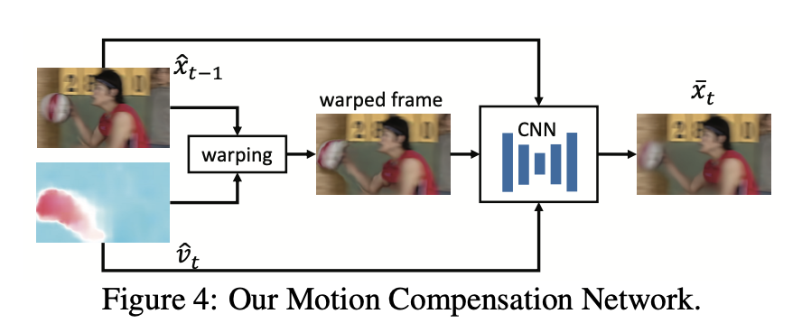
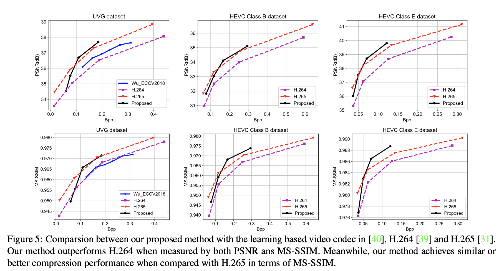
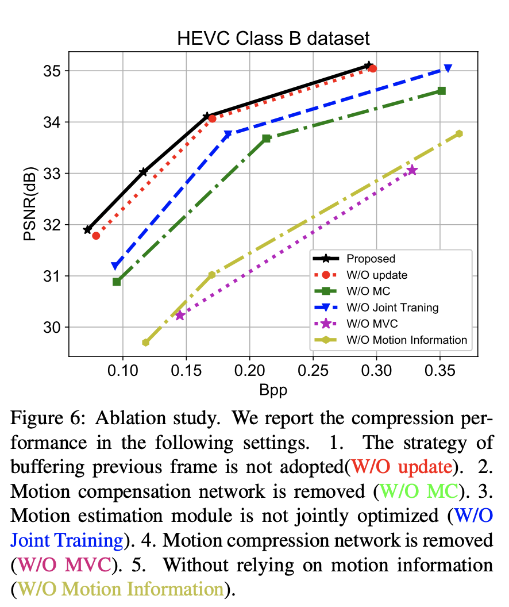
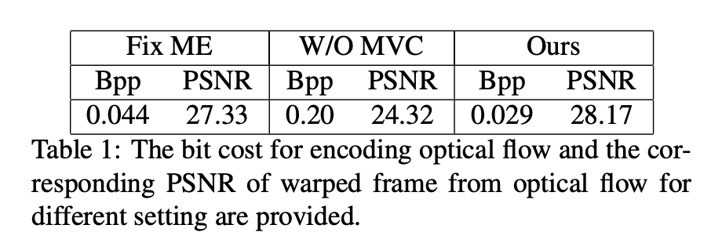
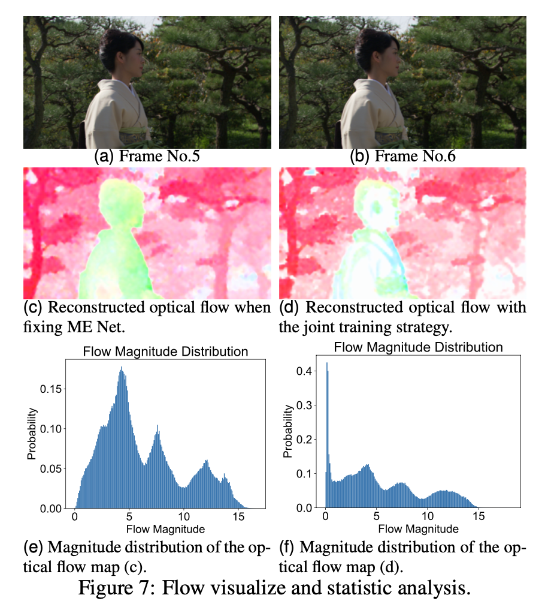

# DVC

DVC: An End-to-end Deep Video Compression Framework

Guo Lu, Wanli Ouyang, Dong Xu, Xiaoyun Zhang, Chunlei Cai, Zhiyong Gao CVPR 2019 (Oral)

DVC 是首个端到端的深度学习视频压缩框架，在深度学习视频压缩领域也常被视为基准算法，在它之后仍有多篇 paper 对其进行优化和改进。

## 摘要

传统的视频压缩方法使用预测编码架构并对相应的运动信息和残差信息进行编码。本文利用传统视频压缩方法中的经典体系结构和强大的神经网络非线性表示能力，提出了第一个端到端视频压缩深度模型，该模型联合优化了视频压缩的所有模块。具体地，基于学习的光流估计被用来获得运动信息并重建当前帧。然后，采用两个自编码器样式的神经网络来压缩相应的运动和残差信息。所有模块都是通过单个损失函数共同学习的，其中，它们通过考虑减少压缩位数和提高解码视频质量之间的权衡来相互协作。实验结果表明，该方法在 PSNR 指标上可以优于广泛使用的视频编码标准 H.264，在 MS-SSIM 指标上甚至可以与最新标准 H.265 媲美。

## 一、简介

### 1.1 Motivation

现如今，视频内容贡献了 80％ 以上的互联网流量 [26]，而且这一比例有望进一步提高。因此，在给定的带宽预算下，构建高效的视频压缩系统并生成更高质量的帧至关重要。

另外，大多数与视频相关的计算机视觉任务，如视频目标检测或视频目标跟踪，对压缩视频的质量敏感，并且有效的视频压缩可能为其它计算机视觉任务带来好处。同时，视频压缩技术也有助于行为识别（action recognition）[41] 和模型压缩（model compression）[16]。

然而，在过去的几十年中，视频压缩算法 [39、31] 依靠手动设计的模块，例如基于块的运动估计和离散余弦变换（DCT）（原文：block based motion estimation and Discrete Cosine Transform (DCT)），来减少视频序列中的冗余。尽管每个模块都经过精心设计，但整个压缩系统并未进行端到端优化。

期望通过联合优化整个压缩系统来进一步提高视频压缩性能。

最近，用于图像压缩的基于深度神经网络（DNN）的自动编码器 [34，11，35，8，12，19，33，21，28，9] 已获得与 JPEG [37]、JPEG2000 [29] 或 BPG [1] 等传统图像编解码器相当甚至更好的性能。一种可能的解释是，基于 DNN 的图像压缩方法可以利用大规模的端到端训练和高度非线性的变换，而传统方法则欠缺这种能力。

但是，直接应用这些技术来构建用于视频压缩的端到端学习系统并非易事。首先，学习如何生成和压缩针对视频压缩量身定制的运动信息仍然是一个尚未解决的问题。视频压缩方法严重依赖运动信息来减少视频序列中的时间冗余。一种简单的解决方案是使用基于学习的光流来表示运动信息。然而，当前基于学习的光流方法旨在产生尽可能精确的流场。但是，对于特定的视频任务，精确的光流通常不是最优的 [42]。此外，与传统压缩系统中的运动信息相比，光流的数据量显着增加，并且直接应用 [39，31] 中的现有压缩方法来压缩光流值将大大增加存储运动所需的位数信息。第二，目前尚不清楚如何通过最小化残差和运动信息的率-失真（rate-distortion）来构建基于 DNN 的视频压缩系统。率-失真优化（RDO，Rate-distortion optimization）的目的是在给出用于压缩的位数（或比特率）（bits (or bit rate)）时，实现更高质量的重构帧（即失真更少）。RDO 对于视频压缩性能很重要。为了利用基于学习的压缩系统的端到端训练能力，需要使用 RDO 策略来优化整个系统。

### 1.2 Contributions

在本文中，作者提出了第一个端到端深度视频压缩（DVC）模型，该模型可以共同学习运动估计、运动压缩和残差压缩。该网络的优点可总结如下：

- 视频压缩中的所有关键组件，即运动估计、运动补偿、残差压缩、运动压缩、量化和比特率估计，都是通过端到端的神经网络实现的。 
- 视频压缩中的关键组件通过单个损失函数，在率-失真权衡的基础上进行联合优化，提高了压缩效率。 
- 传统的视频压缩方法和我们提出的 DVC 模型之间存在一对一的映射关系。这项工作为从事视频压缩、计算机视觉和深层模型设计的研究人员提供了一座桥梁。例如，可以很容易地将更好的光流估计和图像压缩模型插入到该框架中。从事这些领域的研究人员可以使用 DVC 模型作为未来研究的起点。 

实验结果表明，利用本文的神经网络方法对运动信息进行估计和压缩，可以显著提高压缩性能。当用 PSNR 衡量时，该框架优于广泛使用的视频编解码器 H.264，当用多尺度结构相似性指数（MS-SSIM）衡量时，该框架与最新的视频编解码器 H.265 不相上下 [38]。 

## 二、相关工作

### 2.1 Image Compression

在过去的几十年里，人们提出了很多图像压缩算法 [37，29，1]。这些方法严重依赖手工技术。例如，JPEG 标准通过使用 DCT 将像素线性映射到另一个表示，并在熵编码之前量化相应的系数 [37]。一个缺点是这些模块是单独优化的，可能无法达到最佳的压缩性能。

近年来，基于 DNN 的图像压缩方法越来越受到关注 [34，35，11，12，33，8，21，28，24，9]。在文献 [34，35，19] 中，利用递归神经网络（RNNs）建立了一种渐进式图像压缩方案。采用 CNN 的其它编码方式进行网络压缩。为了优化神经网络，文献 [34，35，19] 中的工作只是尽量减少原始帧和重构帧之间的失真（例如，均方误差，mean square error），而没有考虑用于压缩的比特数。[11，12，33，21] 采用了率-失真优化技术，通过在优化过程中引入位数来提高压缩效率。为了估计比特率，在 [28，21，24] 中学习了自适应算术编码方法的上下文模型，而在 [11，33] 中使用了非自适应算术编码。此外，为了提高图像压缩性能，还提出了其他技术，如广义除法归一化（generalized divisive normalization）（GDN）[11]、多尺度图像分解（multi-scale image decomposition）[28]、对抗训练（adversarial training）[28]、重要性图（importance map）[21，24] 和帧内预测（intra prediction）[25，10]。这些现有的工作是本文视频压缩网络的重要组成部分。

### 2.2. Video Compression

在过去的几十年里，人们提出了几种传统的视频压缩算法，如 H.264[39] 和 H.265[31]。这些算法大多遵循预测编码结构。尽管它们提供了高效的压缩性能，但它们是手动设计的，不能以端到端的方式联合优化。

对于视频压缩任务，已经提出了许多基于 DNN 的帧内预测和残差编码方法（intra prediction and residual coding）[13]、模式决策（mode decision）[22]、熵编码（entropy coding）[30]、后处理（post-processing）[23]。这些方法用来改善传统视频压缩算法中某一特定模块的性能，而不是建立端到端的压缩方案。在 [14] 中，Chen 等，提出了一种基于块的视频压缩学习方法。然而，它不可避免地会在块之间的边界产生块度伪影（blockness artifact）。另外，他们利用先前重建的帧通过传统的基于块的运动估计传播的运动信息，这将降低压缩性能。Tsai 等，提出了一种自动编码器网络来压缩特定领域视频的来自 H.264 编码器的残差 [36]。这项工作没有使用深度模型进行运动估计、运动补偿或运动压缩。

最相关的工作是 [40] 中基于 RNN 的方法，其中视频压缩被定义为帧插值（frame interpolation）。然而，他们的方法中的运动信息也是由传统的基于块的运动估计产生的，而这些运动估计是由现有的基于非深度学习的图像压缩方法编码的 [5]。也就是说，运动估计和压缩不是通过深度模型来完成的，也不是与其它组件联合优化的。另外，文献 [40] 中的视频编解码器只着眼于使原始帧和重建帧之间的失真（即均方误差）最小化，而没有考虑训练过程中的率-失真权衡。相比之下，在本文网络中，运动估计和压缩是由 DNN 来实现的，DNN 通过考虑整个压缩系统的率-失真权衡，与其它组件联合优化。

### 2.3. Motion Estimation

运动估计是视频压缩系统中的一个重要组成部分。传统的视频编解码器使用基于块的运动估计算法 [39]，该算法很好地支持硬件实现。

在计算机视觉任务中，光流被广泛应用于时间关系的挖掘。近年来，人们提出了许多基于学习的光流估计方法 [15,27,32,17,18]。这些方法激励我们将光流估计整合到我们的端到端学习框架中。与现有视频压缩方法中基于块的运动估计方法相比，基于学习的光流方法可以在像素级提供精确的运动信息，并且可以进行端到端的优化。然而，如果用传统的视频压缩方法对光流值进行编码，则需要更多的比特来压缩运动信息。

## 三、方法

#### Introduction of Notations

- $\mathcal V=\{x_1,x_2,...,x_{t-1},x_t,...\}$，表示当前视频序列； 
- $x_t$，时间步长 $t$ 处的原始帧； 
- $\bar{x}_t$，预测帧； 
- $\hat{x}_t$，重构/解码帧； 
- $r_t$，原始帧 $x_t$ 和预测帧 $\bar{x}_t$ 之间的残差（误差）； 
- $\hat{r}_t$，表示重建/解码残差；

为了减少时间冗余，需要运动信息。其中，$v_t$ 表示运动矢量或光流值，$\hat{v}_t$ 是其相应的重构版本。可以采用线性或非线性变换来提高压缩效率。因此，残差信息 $r_t$ 被变换为 $y_t$，运动信息 $v_t$ 可以变换为 $m_t$，$\hat{r}_t$ 和 $\hat{m}_t$ 分别是对应的量化版本。

### 3.1 Brief Introduction of Video Compression

在本节中，简要介绍视频压缩。在 [39，31] 中提供了更多详细信息。通常，视频压缩编码器基于输入的当前帧生成比特流。并且解码器基于接收到的比特流来重构视频帧。在图 2 中，所有模块都包括在编码器侧，而蓝色模块不包括在解码器侧。

图 2(a) 是经典的视频压缩框架遵循预测转换架构。输入帧 $x_t$ 被分成相同大小（例如 8×8）的一组块，即正方形区域。编码器端传统视频压缩算法的编码过程如下：

- **Step 1. Motion estimation.（运动估计）** 估计当前帧 $x_t$ 和前一重构帧 $\hat{x}_{t-1}$ 之间的运动，得到每个块对应的运动矢量 $v_t$。 
- **Step 2. Motion compensation.（运动补偿）** 基于 Step 1 中定义的运动矢量 $v_t$，通过将前一重构帧中的对应像素复制到当前帧来获得预测帧 $\bar{x}_t$。原始帧 $x_t$ 与预测帧 $\bar{x}_t$ 之间的残差为 $r_t=x_t−\bar{x}_t$。 
- **Step 3. Transform and quantization.（变换与量化）** 来自 Step 2 的残差 $r_t$ 被量化为 $\hat{y}_t$。在量化之前使用线性变换（例如，DCT），以获得更好的压缩性能。 
- **Step 4. Inverse transform.（反变换）** Step 3 中的量化结果 $\hat{y}_t$ 通过逆变换得到重构残差 $\hat{r}_t$。 
- **Step 5. Entropy coding.（熵编码）** Step 1 中的运动矢量 $v_t$ 和 Step 3 中的量化结果 $\hat{y}_t$ 都通过熵编码方法编码成比特（bits），并发送到解码器。 
- **Step 6. Frame reconstruction.（帧重构）** Step 2 中的预测帧 $\bar{x}_t$ 和 Step 4 中的重构残差 $\hat{r}_t$ 相加来获得重构帧 $\hat{x}_t$。重构帧将被第 $(t+1)$ 帧用于 Step 1 中的运动估计。 

对于解码器，基于在 Step 5 中由编码器提供的比特，在 Step 2 执行运动补偿，在 Step 4 执行反量化，然后在 Step 6 执行帧重构以获得重构帧 $\hat{x}_t$。

### 3.2 Overview of the Proposed Method

图 2(b) 端到端视频压缩框架，传统的视频压缩框架与本文提出的基于深度学习的框架之间存在一一对应关系。两者之间的关系及差异简要如下：

- **Step N1. Motion estimation and compression.（运动估计与压缩）** 使用 CNN 模型来估计光流 [27]，它被认为是运动信息 $v_t$。图 3 中提出了一个 MV 编解码器网络来压缩和解码光流值，而不是直接编码原始光流值。通过运动编码器网络编码得到 $m_t$，量化后的运动信息表示为 $\hat{m}_t$，运动信息 $v_t$ 经过 MV 解码器网络解码得到重构运动信息 $\hat{v}_t$。详见第 3.3 节。 
- **Step N2. Motion compensation.（运动补偿）** 基于 Step N1 中获得的光流，通过运动补偿网络来获得预测帧 $\bar{x}_t$。详见第 3.4 节。 
- **Step N3-N4. Transform, quantization and inverse transform.（变换、量化与反变换）** 使用高度非线性的残差编解码网络替换了 Step 3 中的线性变换，并通过残差编码网络将残差 $r_t$ 非线性映射到 $y_t$ 上。 然后将 $y_t$ 量化为 $\hat{y}_t$。为了建立端到端的训练方案，采用了文献 [11] 中的量化方法。然后 $\hat{y}_t$ 经过残差解码网络得到重构残差 $\hat{r}_t$。详见第 3.5 和 3.6 节。
- **Step N5. Entropy coding.（熵编码）** 在测试阶段，将来自 Step N1 的量化运动信息 $\hat{m}_t$ 和来自 Step N3 的残差表示 $\hat{y}_t$ 编码为比特，然后发送到解码器。在训练阶段，为了估算比特数成本，使用 CNNs（图 2 中的比特率估算网络）来获得 $\hat{m}_t$ 和 $\hat{y}_t$ 中每个符号的概率分布。详见第 3.6 节。
- **Step N6. Frame reconstruction.（帧重构）** 和 3.1 中的 Step 6 一样。Step N2 中的预测帧 $\bar{x}_t$ 和 Step N4 中的重构残差 $\hat{r}_t$ 相加来获得重构帧 $\hat{x}_t$。重构帧将被第 $(t+1)$ 帧用于 Step N1 中的运动估计。 

### 3.3 MV Encoder and Decoder Network

为了在 Step N1 压缩运动信息，设计了一个 CNN 将光流转换为相应的表示形式，以获得更好的编码效果。 具体来说，利用自动编码器样式的网络来压缩光流，这是 [11] 首次提出的用于图像压缩的任务。整个 MV 压缩网络如图 3 所示。光流 $v_t$ 经过一系列的卷积运算和非线性变换。除最后一个反卷积层等于 2 之外，用于卷积（反卷积）的输出通道数为 128。给定光流 $v_t$ 的大小为 $M×N×2$，MV 编码器将生成大小为 $M/16×N/16×128$ 的运动表示 $m_t$，然后 $m_t$ 被量化为 $\hat{m}_t$。MV 解码器接收量化表示 $\hat{m}_t$ 并重构运动信息得到 $\hat{v}_t$。此外，量化表示 $\hat{m}_t$ 还将用于熵编码。 

### 3.4 Motion Compensation Network

给定前一重构帧 $\hat{x}_{t-1}$ 和运动矢量 $\hat{v}_t$，运动补偿网络将获得预测帧 $\bar{x}_t$，该预测帧预计尽可能接近当前帧 $x_t$。首先，基于运动信息 $\hat{v}_t$ 将前一重构帧 $\hat{x}_{t-1}$ 变换到当前帧（current frame）。变换的帧仍然有伪影。为了消除伪影，将变换的帧 $w(\hat{x}_{t-1},\hat{v}_t)$、参考帧 $\hat{x}_{t-1}$ 和运动矢量 $\hat{v}_t$ 连接起来作为输入，然后将它们输入到另一个 CNN 中，以获得精确的预测帧 $\bar{x}_t$。网络的总体架构如图 4 所示。图 4 中 CNN 的细节在补充材料中提供。本文提出的方法是一种像素级的运动补偿方法，它可以提供更精确的时间信息，并且避免了传统的基于块的运动补偿方法中的块效应。这意味着不需要手工制作的循环滤波器或样本自适应偏移技术（loop filter or the sample adaptive offset technique）[39，31] 来进行后期处理。

### 3.5 Residual Encoder and Decoder Network

如图 2 所示，原始帧 $x_t$ 和预测帧 $\bar{x}_t$ 之间的残差信息 $r_t$ 由残差编码器网络编码。本文利用文献 [12] 中高度非线性的神经网络将残差转化为相应的潜在表示。与传统视频压缩系统中的离散余弦变换相比，该方法可以更好地利用非线性变换的能力，获得更高的压缩效率。

### 3.6 Training Strategy

#### Loss Function

视频压缩框架的目标是最小化用于对视频进行编码的位数，同时减少原始输入帧 $x_t$ 与重构帧 $\hat{x}_t$ 之间的失真。因此，文章提出以下率-失真优化问题， 

$$λD+R=λd(x_t,\hat{x}_t)+(H(\hat{m}_t)+H(\hat{y}_t))\tag1$$

其中 $d(x_t,\hat{x}_t)$ 表示 $x_t$ 和 $\hat{x}_t$ 之间的失真，在实现中使用均方误差（MSE）。$H(\cdot)$ 表示用于编码表示表示的位数。在本文方法中，残差表示 $\hat{y}_t$ 和运动表示 $\hat{m}_t$ 都应该被编码到比特流中。$λ$ 是拉格朗日乘数，它决定了比特数和失真之间的权衡。如图 2(b) 所示，将重构帧 $\hat{x}_t$、原始帧 $x_t$ 和估计比特输入到损失函数。

#### Quantization

在熵编码之前，需要对残差表示 $y_t$ 和运动表示 $m_t$ 等潜在表示进行量化。然而，量化运算不是差分的，这使得端到端的训练变得不可能。为了解决这个问题，已经有很多方法被提出 [34，8，11]。本文采用文献 [11] 中的方法，并在训练阶段通过加入均匀噪声来代替量化运算。以 $y_t$ 为例，训练阶段的量化表示 $\hat{y}_t$ 是通过在 $y_t$ 上加上均匀噪声来近似得到的，即 $\hat{y}_t=y_t+η$，其中 $η$ 是均匀噪声。在推理阶段，直接四舍五入取整，即 $\hat{y}_t=round(y_t)$。

#### Bit Rate Estimation

为了优化整个网络的比特数和失真度，需要获得所生成的潜在表示 $\hat{y}_t$ 和 $\hat{m}_t$ 的比特率 $H(\hat{y}_t)$ 和 $H(\hat{m}_t)$。比特率的正确度量是对应潜在表示符号的熵。因此，我们可以估计 $\hat{y}_t$ 和 $\hat{m}_t$ 的概率分布，然后得到相应的熵。本文利用 [12] 中的 CNNs 来估计分布。

#### Buffering Previous Frames

如图 2 所示，在压缩当前帧时，在运动估计和运动补偿网络中需要前一重构帧 $\hat{x}_{t-1}$。但是，前一重构帧 $\hat{x}_{t-1}$ 是基于重构帧 $\hat{x}_{t-2}$ 的网络输出，依此类推。因此，在帧 $x_t$ 的训练过程中可能需要帧 ${x_1,...,x_{t−1}}$，这会减少小批量中训练样本的变化，并且当 $t$ 较大时可能无法将其存储在 GPU 中。

为了解决这个问题，本文采用了在线更新策略：每次迭代中的重构帧 $\hat{x}_t$ 将保存在缓冲区中。在接下来的迭代中，当编码 $x_{t+1}$ 时，缓冲区中的 $\hat{x}_t$ 将用于运动估计和运动补偿。因此，缓冲区中的每个训练样本都将在一个 epoch 中更新。这样，可以在每次迭代中为一个视频片段优化并存储一个帧，从而更加高效。

## 四、实验

### 4.1 Experimental Setup

#### Datasets

作者使用 Vimeo-90k 数据集 [42] 来训练提出的视频压缩框架，该数据集是该数据集是最近为评估不同的视频处理任务（如视频去噪和视频超分辨率）而构建的。它由 89,800 个独立的剪辑组成，这些剪辑的内容互不相同。

为了报告所提出的方法的性能，作者在 UVG 数据集 [4] 和 HEVC 标准测试序列（B 类，C 类，D 类和 E 类）[31] 上评估了提出的算法。这些数据集的内容和分辨率是多种多样的，它们被广泛用于衡量视频压缩算法的性能。

**Evaluation Method（评估方法）** 为了测量重构帧的失真，我们使用两个评估指标：PSNR 和 MS-SSIM [38]。与 PSNR 相比，MS-SSIM 与人对失真的感知更好地相关。为了测量编码表示形式的位数，我们使用每像素位数（Bpp）表示当前帧中每个像素所需的位数。

**Implementation Details（实施细节）** 作者用不同 $\lambda$（$\lambda$ = 256，512，1024，2048）训练了四个模型。对于每个模型，使用 Adam 优化器 [20]，分别将初始学习率设置为 0.0001，$\beta_1$ 设置为 0.9，将 $\beta_2$ 设置为 0.999。当损失趋于稳定时，学习率除以 10。mini-batch size 设置为 4。训练图像的分辨率为 256×256。运动估计模块使用 [27] 中的预训练权重进行初始化。整个系统基于 Tensorflow 实现，使用两个 Titan X GPU 对整个网络进行训练大约需要 7 天时间。

### 4.2 Experimental Results

在本节中，将 H.264[39] 和 H.265[31] 都包括在内进行比较。此外，在文献 [40] 中 Wu_ECCV2018 的基于学习的视频压缩系统也包括在内以进行比较。为了通过 H.264 和 H.265 生成压缩帧，按照 [40] 中的设置，使用快速模式的 FFmpeg。UVG 数据集和 HEVC 数据集的 GOP 大小分别为 12 和 10。有关 H.264/H.265 设置的更多详细信息，请参阅补充资料。

图 5 显示了在 UVG 数据集、HEVC B 类和 E 类数据集上的实验结果。补充材料中提供了 HEVC C 级和 D 级的结果。显然，本文方法在很大程度上优于最新的视频压缩 [40]。在 UVG 数据集上，该方法在相同的 Bpp 水平下获得了约 0.6dB 的增益。值得一提的是，本文方法仅使用一个之前的参考帧，而 Wu 等人的工作却没有。[40] 利用双向帧预测，并且需要两个相邻帧。因此，利用多个参考帧中的时间信息可以进一步提高框架的压缩性能。

在大多数数据集上，当通过 PSNR 和 MS-SSIM 来衡量，本文提出的框架优于 H.264 标准。此外，与 H.265 相比，该方法在 MS-SSIM 指标上具有类似或更好的压缩性能。如前所述，损失函数中的失真项由 MSE 度量。尽管如此，根据 MS-SSIM，本文方法仍可以提供合理的视觉质量。 

### 4.3 Ablation Study and Model Analysis

#### Motion Estimation

在本文提出的方法中，利用了端到端训练策略的优势，在整个网络中对运动估计模块进行优化。 因此，基于率-失真优化，系统中的光流有望得到进一步压缩，从而得到更精确的变换帧（warped frames）。为了验证其有效性，作者在整个训练阶段对初始化的运动估计模块的参数进行了固定，在这种情况下，对运动估计模块进行预训练只是为了更准确地估计光流，而不是为了获得最佳的率-失真。图 6 中的实验结果表明，与采用固定运动估计的方法相比，采用联合训练进行运动估计的方法可以显著提高运动估计的性能，在图 6 中由 W/O 联合训练表示（见蓝色曲线） 。 

在表 1 中展示了用于编码光流的平均比特成本和相应的转换帧（warped frame）的峰值信噪比 PSNR。具体地说，当运动估计模块在训练阶段固定时，对产生的光流进行编码需要 0.044bpp，相应的转换帧的 PSNR 为 27.33db。相比之下，在本文提出的方法中，需要 0.029bpp 来编码光流，并且转换帧的 PSNR 更高（28.17dB）。因此，联合学习策略不仅节省了编码操作所需的比特数，而且具有更好的转换图像质量。这些实验结果清楚地表明，将运动估计应用于率-失真优化可提高压缩性能。

在图 7 中，提供了进一步的视觉比较。图 7(a) 和 (b) 表示序列的帧 5 和帧 6。图 7(c) 表示在训练过程中光流网络被固定时的重建光流图。图 7(d) 表示使用联合训练策略后的重建光流图。图 7(e) 和 (f) 是光流量值的相应概率分布。可以看出，使用本文方法重建的光流包含了更多的像素，这些像素的流大小为零（例如，在人体区域）。尽管在这些区域中零值不是真正的光流值，但本文方法仍可以在均匀区域中生成精确的运动补偿结果。更重要的是，具有更多零值的光流图需要更少的比特来进行编码。例如，在图 7(c) 中对光流图进行编码需要 0.045bpp，而对图 7(d) 中的光流图进行编码仅需要 0.038bpp。

应该提到的是，在 H.264[39] 或 H.265[31] 中，为了获得更好的压缩性能，许多运动矢量被分配为零。令人惊讶的是，本文提出的框架可以学习相似的运动分布，而无需像 [39，31] 中那样依赖任何复杂的手工制作的运动估计策略。 

#### Motion Compensation

本文利用运动补偿网络，在估计光流的基础上，对转换帧进行改善（refine the warped frame）。为了评估该模块的有效性，作者进行了另一个实验，移除了系统中的运动补偿网络。用 W/O MC 表示的另一种方法的实验结果（见图 6 中的绿色曲线）表明，在相同的 bpp 水平下，没有运动补偿网络的 PSNR 将下降约 1.0db。

#### Updating Strategy（更新策略）

如第 3.6 节所述，在对当前帧 $x_t$ 进行编码时，我们使用在线缓冲区在训练阶段存储先前重建的帧 $\hat{x}_{t-1}$，同时在训练阶段将先前重建的帧 $\hat{x}_{t-1}$ 直接替换为先前的原始帧 $x_{t-1}$ 时的压缩性能。由 W / O 更新表示的替代方法的结果（参见红色曲线）如图 6 所示。它表明，在相同的 bpp 电平下，缓冲策略可以提供约 0.2dB 的增益。

如第 3.6 节所述，在对当前帧 $x_t$ 进行编码时，使用在线缓冲区在训练阶段存储前一重构帧 $\hat{x}_{t-1}$。同时在训练阶段，当前一重构帧 $\hat{x}_{t-1}$ 被先前的原始帧 $x_{t−1}$ 直接替换时的压缩性能。图 6 显示了由 W/O update 表示的替代方法的结果（见红色曲线）。结果表明，在相同的 bpp 水平下，缓冲策略可以提供约 0.2dB 的增益。

#### MV Encoder and Decoder Network（MV 编码器和解码器网络）

在本文提出的框架中，作者设计了一个 CNN 模型来压缩光流并编码相应的运动表示。在不使用 CNN 的情况下，直接对原始光流值进行量化编码也是可行的。作者进行了一个新的实验，去掉了 MV 编解码器网络。图 6 中的实验结果表明，去除运动压缩网络后，用 W/O MVC 表示的替代方法的 PSNR（见红色曲线）将下降超过 2db。此外，表 1 还提供了在该设置下对光流进行编码的比特成本和相应的转换帧的 PSNR（用 W/O MVC 表示）。很明显，直接编码原始光流值需要更多的比特（0.20Bpp），对应的 PSNR（24.43dB）比本文方法（28.17dB）要差得多。因此，当光流用于运动估计时，运动压缩是至关重要的。

#### Motion Information（运动信息）

在图 2(b) 中，还研究了仅保留残差编码器和解码器网络的设置。与本文方法相比，在不使用任何运动估计方法的情况下单独处理每个帧（见由 W/O 运动信息表示的黄色曲线）导会致 PSNR 下降超过 2dB。

#### Running Time and Model Complexity（运行时间和模型复杂性）

本文提出的端到端视频压缩框架的参数总数约为 11M，为了测试不同编解码器的速度，使用装有 Intel Xeon E5-2640 v4 CPU 和单个 Titan 1080Ti GPU 的计算机进行了实验。对于分辨率为 352x288 的视频，Wu 等人 [40] 的每次迭代的编码（解码）速度为 29fps（38fps），而本文的整体速度是 24.5fps（41fps）。基于官方软件 JM[2] 和 HM[3] 的 H.264 和 H.265 的编码速度分别为 2.4fps 和 0.35fps。商业软件 x264[6] 和 x265[7] 的编码速度分别为 250fps 和 42fps。虽然商用编解码器 x264[6] 和 x265[7] 可以提供比本文更快的编码速度，但它们仍需要大量代码优化。

#### Bit Rate Analysis（比特率分析）

本文利用文献 [12] 中的概率估计网络估计运动信息和残差信息的比特率。为了验证可靠性，使用图 8(a) 中的算术编码来比较估计的比特率和实际的比特率。很明显，估计的比特率与实际比特率很接近。此外，还进一步研究了比特率的组成。在图 8(b) 中，提供每个点的 $λ$ 值和运动信息的百分比。当目标函数 ${λD+R}$ 中的 $λ$ 变大时，整个 Bpp 也变大，而相应的运动信息百分比下降。

## 五、总结

本文提出了一个完整的端到端深度学习视频压缩框架。该框架继承了传统视频压缩标准中经典预测编码方案的优点以及 DNNs 强大的非线性表示能力。实验结果表明，该方法优于目前广泛采用的 H.264 视频压缩标准和最新的基于学习的视频压缩系统。该工作为深度神经网络在视频压缩中的应用提供了一个很有前景的框架。基于所提出的框架，其他新的光流技术、图像压缩技术、双向预测技术和速率控制技术都可以很容易地嵌入到该框架中。

## 实现

OpenDVC: An Open Source Implementation of the DVC Video Compression Method

[开源](https://github.com/RenYang-home/OpenDVC)

DVC 原文中仅有 PSNR 优化的模型，我们的 OpenDVC 开源代码中不仅复现 DVC 的 PSNR 优化模型，还提供 MS-SSIM 优化的 DVC 模型。我们希望开源模型能够为未来的研究者提供便利，并且希望 OpenDVC 的 MS-SSIM 模型能够为其他针对 MS-SSIM 优化的视频压缩方法在性能比较时提供更有说服力的基准。

OpenDVC 源代码的视频压缩性能与 DVC 原文中结果相似， 如下图所示。我们的 OpenDVC (PSNR) 模型在 PSNR 和 MS-SSIM 性能上均与 DVC 基本相当，我们的 OpenDVC (MS-SSIM) 模型在 MS-SSIM 性能上明显优于原 DVC 方法。

### 复现源码与DVC不同点

1. 多提供了优化MS-SSIM的DVC模型；
2. 运动压缩网络上下采用4倍，而原始DVC上下采用5倍；
3. 残差压缩网络与运动压缩网络结构一样，唯一的区别就是利用5x5的卷积替换掉3x3的卷积，因为残差中包含的信息比光流中要多。这一点值得学习一下。

### 训练策略

1. 首先训练运动估计网络。原始的DVC中直接采用光流网络的预训练参数；
2. 再把运动压缩放到训练中去；
3. 开始训练运动补偿模块；
4. 所有网络联合训练。

另外，在 [M-LVC](https://blog.csdn.net/cs_softwore/article/details/106456445) 描述了另一个复现DVC的训练过程，正好与这篇文章相反，先固定光流网络，跳过光流编解码网络和光流熵估计网络，先联合训练运动补偿、残差编解码、残差熵估计网络，然后再加入前半部分联合训练。

DVC整个框架很明晰，任何一个模块复现起来都不是很复杂，主要是怎么联合训练起来。因为网络很多，所有网络直接联合训练，根据我的经验，很有可能会使其中一个或多个网络的收敛方向被带偏，最后导致梯度爆炸，不管是先训练前半部分还是后半部分，宗旨就是先训练少量网络再联合训练所有网络。
