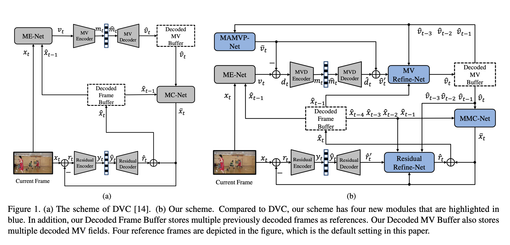
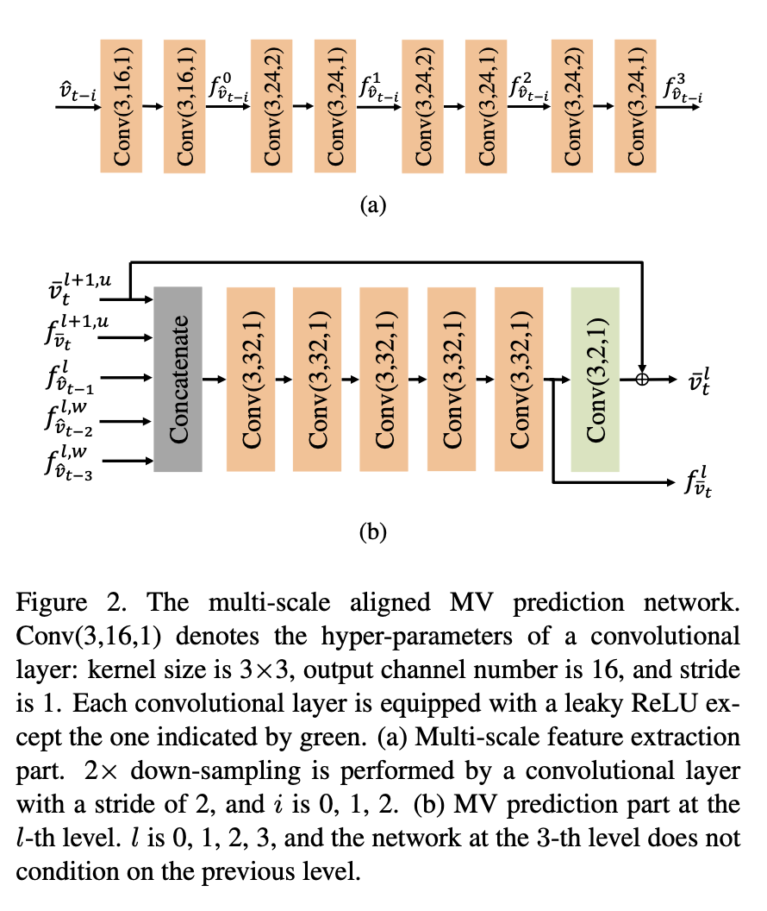
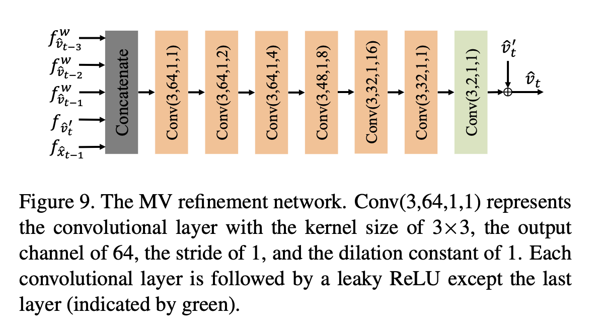
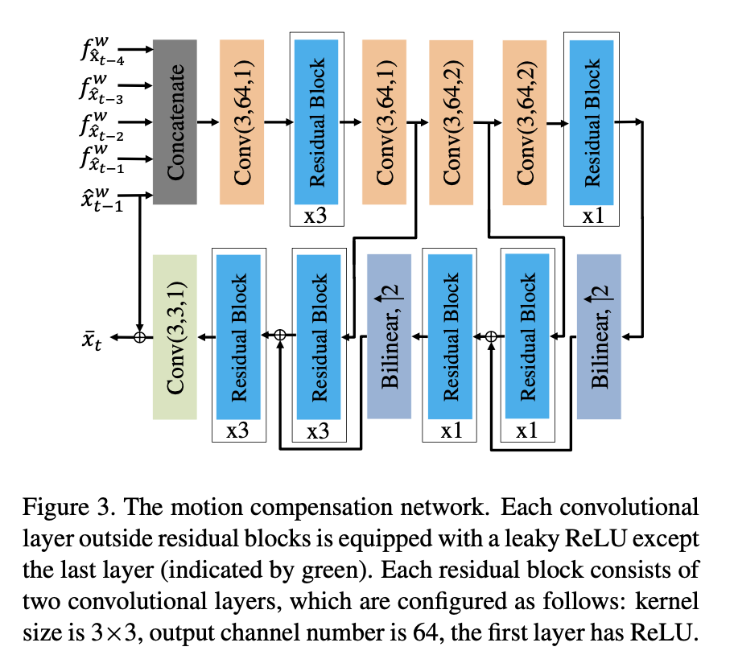
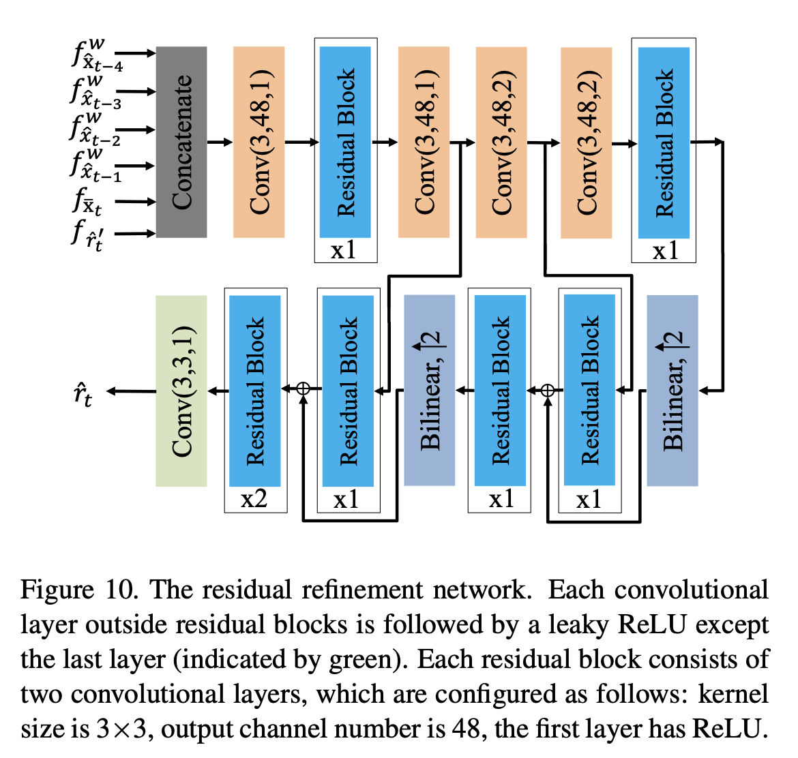
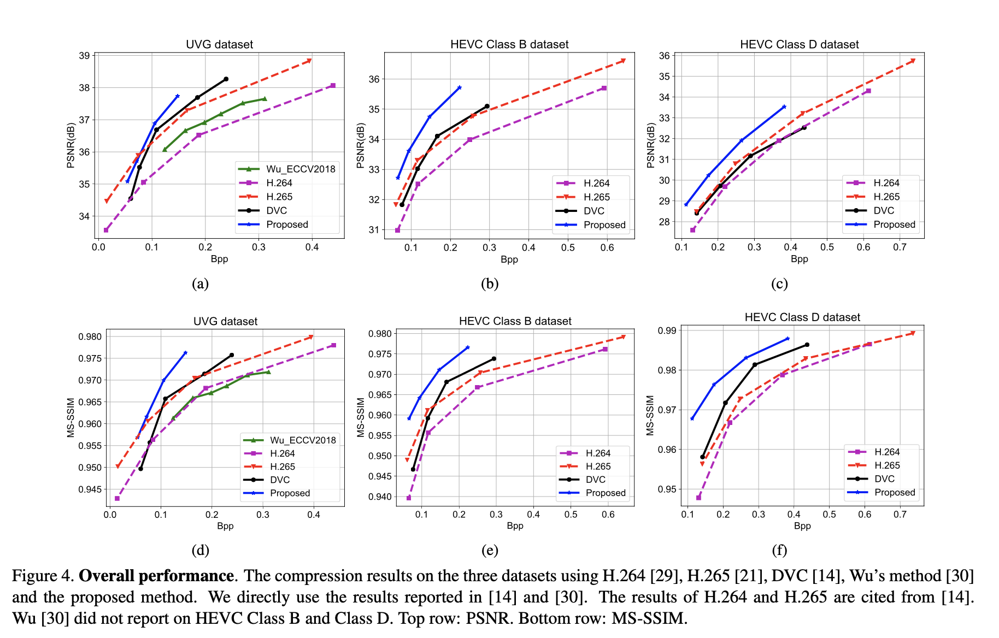
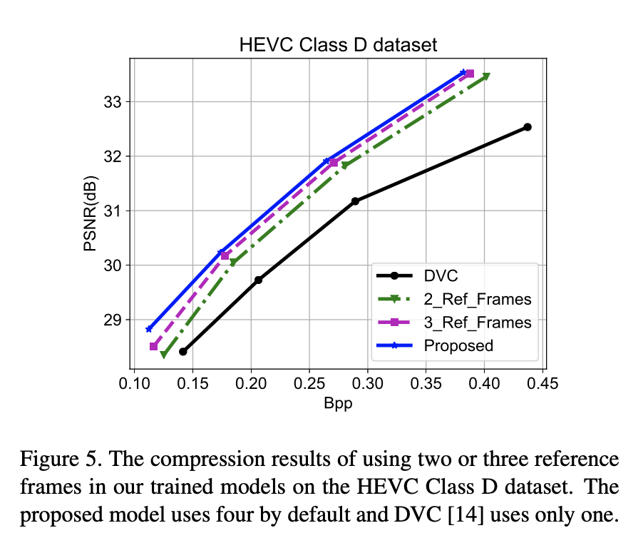
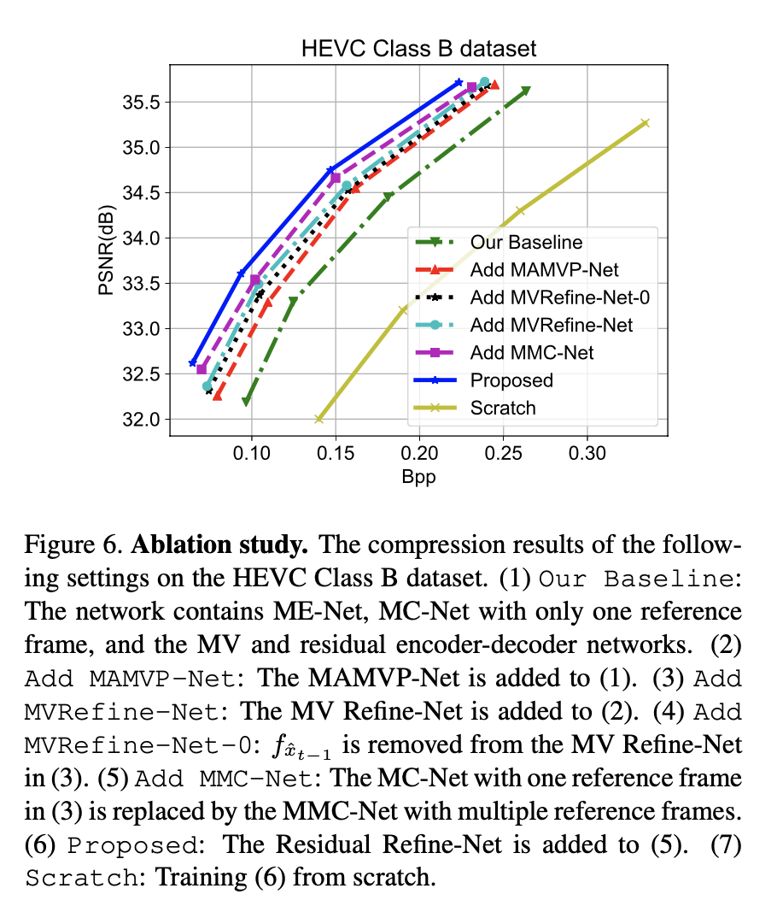
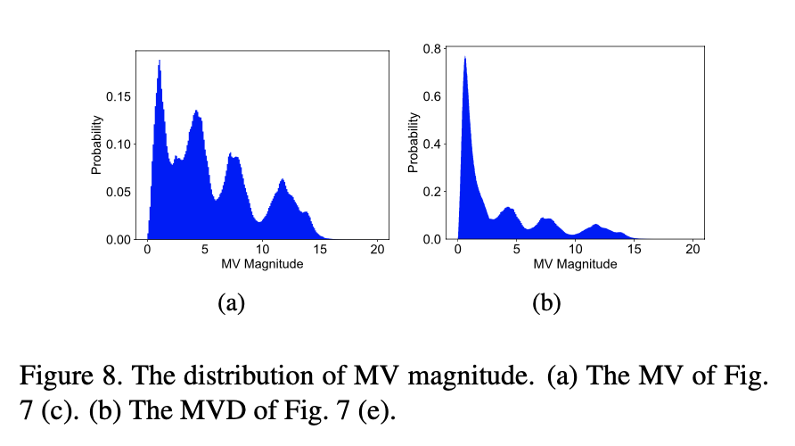
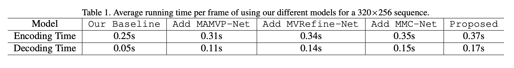

# M-LVC

M-LVC: Multiple Frames Prediction for Learned Video Compression

Jianping Lin, Dong Liu, Houqiang Li, Feng Wu CVPR 2020

DVC 的升级版！

[开源](https://github.com/JianpingLin/M-LVC_CVPR2020)

## 摘要

本文提出了一种适用于低延迟场景的端到端学习视频压缩方案。以往的方法都局限于以前一帧作为参考，本文方法引入前面的多个帧作为参考。在本文方案中，计算当前帧与前一帧之间的运动向量（the motion vector (MV) field）。在多个参考帧和多个 MV 的情况下，本文设计的网络可以对当前帧产生更精确的预测，产生更少的残差。多参考帧也有助于生成 MV 预测，从而降低 MV 的编码成本。使用两个深度自动编码器分别压缩残差和 MV。为了补偿自动编码器的压缩误差，同时利用多个参考帧，进一步设计了一个 MV 优化网络和一个残差优化网络。在本文方案中，所有的模块都是通过单个的率-失真损失函数来联合优化的。采用分步训练策略来优化整个方案。实验结果表明，在低延迟模式下，该方法优于现有的学习视频压缩方法。方法在 PSNR 和 MS-SSIM 方面也优于 H.265。

因为 DVC 的编解码框架类似于混合编解码框架，所以减少 MV 和残差的码率是优化的关键，DVC 框架的 P 帧编码是借助前一个解码帧进行运动估计、运动补偿、残差编解码等相关操作，而本文是借助借助前面多帧进行这些操作，理论上是可以提升 DVC 的编解码性能，可以减缓错误传播的速度。

## 一、简介

### 1.1 Motivation

视频在 2017 年占所有互联网流量的 75％，预计到 2022 年将达到 82％[7]。 将视频压缩成较小的尺寸是降低传输成本的迫切要求。当前，互联网视频通常被压缩为 H.264[31] 或 H.265[22] 格式。H.266 和 AV1 等新的视频编码标准即将推出。尽管新标准有望改善压缩率，但这种改进伴随着成倍增加的编码复杂性。实际上，所有正在使用或即将采用的标准都遵循相同的框架，即运动补偿预测，基于块的变换和手工熵编码。该框架已经被继承了三十多年，并且框架内的发展逐渐饱和。

近年来，一系列的研究试图在经过训练的深度网络上构建全新的视频压缩方案。这些研究根据其目标情景可分为两类。对于第一类，Wu 提出了一种基于递归神经网络（RNN）的插值视频压缩方法 [32]，其中运动信息通过传统的基于块的运动估计来获得，并通过图像压缩方法进行压缩。随后，Djelouah 等人也提出了一种基于插值的视频压缩方法，该方法将运动信息压缩和图像合成相结合，图像和残差使用相同的自动编码器 [8]。基于插值的压缩使用前一帧和后一帧作为参考来压缩当前帧，这在诸如回放之类的随机访问场景中是有效的。然而，它不太适用于低延迟场景，如实时传输。

第二类研究针对低延迟情景，并限制网络仅使用时间上的先前帧作为参考。例如，Lu 等人。DVC 提出了一种端到端的深度视频压缩模型，该模型可共同学习运动估计，运动压缩，运动补偿和残差压缩函数 [15]。在该模型中，仅使用前一帧进行运动补偿，这可能无法充分利用视频帧中的时间相关性。Rippel 等人。提出了另一种视频压缩模型，它保持一个潜在的状态来存储先前帧的信息 [19]。由于存在潜在状态，该模型很难训练，并且对传输误差敏感。

在本文中，针对低延迟情景，作者提出一种端到端的学习视频压缩方案。关键思想是使用前面的多个帧作为参考。与只使用一个参考帧的 DVC 相比，使用的多个参考帧将预测提高了两倍。首先，给定多个参考帧和相关联的多个运动向量（MV），可以导出用于预测当前帧的多个假设；这些假设的组合提供了一个集合。第二，给定多个 MV，可以进行外推来预测下一个 MV，利用 MV 预测可以降低 MV 的编码成本。因此，该方法被称为学习视频压缩的多帧预测（M-LVC）。注意在文献 [19] 中，先前多帧的信息被隐式地用于通过潜在状态来预测当前帧；但是在本文方案中，多帧预测是显式处理的。因此，本文方案具有更高的可扩展性（即可以使用更多或更少的参考），更易于解释（即通过运动补偿实现预测），并且根据我们的观察结果更易于训练。

此外，在本文中，设计了一个 MV 优化网络（MV refinement network）和一个残差优化（residual refinement network）网络。由于使用深度自动编码器来压缩 MV(resp. residual)，所以压缩是有损的，并且在解码后的 MV(resp. residual) 中会产生错误。采用 MV(resp. residual) 优化网络补偿压缩误差，提高重建质量。还使用了多个参考帧和/或相关的多个 MV 在残差/MV 优化网络中的应用。

### 1.2 Contributions

- 在端到端学习视频压缩中引入了四个有效模块：基于多个帧的 MV 预测，基于多个帧的运动补偿，MV 优化细化和残差优化。消融研究证明了这些模块所获得的收益。
- 采用率-失真损失函数和逐步的训练策略来共同优化方案中的所有模块。只采用优化一个率失真损失函数和 step-by-step 的训练策略。
- 优于现有的视频压缩方法，在 PSNR 和 MS-SSIM 方面的性能均优于 H.265（low-latency mode）。性能超过现有基于学习的视频编解码和 H265 算法（低延时）。

DVC 说自己优于 H.264，M-LVC 又说自己优于 H.264 和 H.265，实质上是跟 H.264 和 H.265 的 veryfast 模式去对比的（还设置了 I 帧间隔和 B 帧数目…），测了下 H.264 和 H.265 的默认参数，HEVC-ClassB 上 M-LVC 算略差于 H.264 吧，UVG 上差的挺多… 

> veryfast 模式通过`-perset`参数来设置，主要用来调节编码速度和质量的平衡，速度越慢，质量越好，压缩比越大，默认是`medium`（10 个档：ultrafast，superfast，veryfast，faster，fast，medium，slow，slower，veryslow，placebo）

## 二、相关工作

### 2.1 Learned Image Compression

近年来，基于深度学习的图像压缩方法取得了很大的进展 [3，4，12，16，25，26]。与传统图像编解码器（如 JPEG[27]、JPEG2000[21] 和 BPG[5] 中的手工技术不同，新方法可以从数据中学习非线性变换，并以端到端的方式估计熵编码所需的概率。在 [12，25，26] 中，基于长短时记忆（LSTM）的自动编码器被用来逐步地对原始图像和重建图像之间的差异进行编码。此外，有一些研究利用卷积神经网络（CNN）的自动编码器压缩图像 [3，4，16，24]。例如，Ball’e 等人 [3] 在基于 CNN 的自动编码器中引入了一个非线性激活函数，即广义除法归一化（GDN），并使用完全连接的网络估计潜在表示的概率。该方法的性能优于 JPEG2000。它没有考虑输入自适应熵模型。Ball’e 等人在 [4] 中引入了一个输入自适应熵模型，该模型使用零均值高斯分布对每个潜在表示进行建模，并通过参数变换预测标准差。最近，Minnen 等人 [16] 通过整合上下文自适应模型进一步改进了上述输入自适应熵模型，他们的方法优于 BPG。本文基于文献 [3，4] 中的图像压缩方法，设计了运动矢量和残差的压缩模块。我们注意到在学习图像压缩模型方面的新进展可以很容易地集成到我们的方案中。

### 2.2 Learned Video Compression

与学习图像压缩相比，学习视频压缩的相关工作要少得多。2018 年，Wu 等人提出了一种基于 RNN 的插值视频压缩方法 [32]。他们首先使用图像压缩模型来压缩关键帧，然后使用分层插值生成其余帧。采用传统的基于块的运动估计提取运动信息，并采用传统的图像压缩方法进行编码。Han 等人提出使用变分自动编码器（VAEs）压缩序列数据 [9]。他们的方法共同学习将原始视频转换为低维表示，并根据时间条件概率模型对这些表示进行熵编码。然而，他们的模型仅限于低分辨率视频。最近，Djelouah 等人提出了一种基于插值的视频压缩方案，其中运动和混合系数直接从潜在表示中解码，残差直接在潜在空间中计算 [8]。但插值模型和残差压缩模型并没有联合优化。

虽然上述方法是为随机访问模式设计的，但其他一些方法也被开发用于低延迟模式。例如，Lu 等人提出用基于 CNN 的组件来代替传统视频压缩框架中的模块，即运动估计、运动压缩、运动补偿和残差压缩 [15]。他们的模型直接压缩运动信息，并且仅使用前一帧作为运动补偿的参考。Rippel 等人提出通过保持一个潜在状态来利用多个参考帧的信息 [19]。由于隐态的存在，其模型难以训练，且对传输误差敏感。我们的方案也针对低延迟模式进行了定制，我们将在下面更具体地与 [15] 进行比较。

## 三、方法

#### Notations

- $\mathcal V=\{x_1,x_2,...,x_t,...\}$，表示原始视频序列；
- $x_t$，表示时间步长 $t$ 处的原始帧； 
- $\bar{x}_t$，预测帧； 
- $\hat{x}_t$，重构/解码帧；
- $r_t$，原始帧 $x_t$ 和预测帧 $\bar{x}_t$ 之间的残差； 
- $\hat{r}'_t$，表示残差 auto-encoder 重建的残差； 
- $\hat{r}_t$，表示最终解码残差；
- $v_t$，表示时间步长 $t$ 处原始 MV； 
- $\bar{v}_t$，预测 MV； 
- $\hat{v}_t$，解码 MV； 
- $d_t$，原始 MV $v_t$和预测 MV $\bar{v}_t$之间的 MV 差（MVD）； 
- $\hat{d}_t$，表示 MVD auto-encoder 重建的 MVD； 
- $\hat{v}'_t$，表示通过将 $\hat{d}_t$ 加到 $\bar{v}_t$ 中重建的 MV；

在自动编码器的非线性变换中，残差 $r_t$ 和 MVD $d_t$ 被转换成 $y_t$ 和 $m_t$，$\hat{y}_t$ 和 $\hat{m}_t$ 分别是相应的量化版本。

### 3.1 Overview of the Proposed Method

<div align=center></div>

图 1 分别是 DVC 和 M-LVC 的方案，M-LVC 中新增了 4 个模块（图种蓝色框）。具体如下：

- **Step 1. Motion estimation and prediction.** 将当前原始帧 $x_t$ 和前一重构帧 $\hat{x}_{t-1}$ 送入运动估计网络（ME-Net）中，提取运动信息 $v_t$，本文基于目前最先进的光流网络 FlowNet2.0[11]。不像 DVC 中那样直接编码像素级的 MV（$v_t$）（这会导致较高的编码成本），而是采用 MV 预测网络（MAMVP-Net）来预测当前的 MV，这可以很大程度上消除 MV 的时间冗余。详见第 3.2 节。
- **Step 2. Motion compression and refinement.** 运动预测后，使用 MVD 编码器/解码器网络对原始 MV（$v_t$）和预测的 MV（$\bar{v}_t$）之间的差 $d_t$ 进行编码，网络结构与 [3] 相似。该 MVD 编解码网络可以进一步去除 $d_t$ 中存在的空间冗余。具体而言，首先将 $d_t$ 非线性映射到潜在表示 $m_t$ 中，然后通过舍入运算量化到 $\hat{m}_t$。然后由 [3] 中提出的 CNNs 估计出 $\hat{m}_t$ 的概率分布。在推断阶段，使用估计的分布将 $\hat{m}_t$ 熵编码为比特流。然后，可以通过非线性逆变换从熵解码后的 $\hat{m}_t$ 中重构 $\hat{d}_t$。由于解码后的 $\hat{d}_t$ 包含量化带来的误差，尤其是在低比特率下，因此建议使用 MV 优化网络（MV Refine-Net）来减少量化误差并提高质量。然后，将优化后的 MV（$\hat{v}_t$）缓存在解码的 MV 缓冲器中，用于下一帧编码。详见第 3.3 节。
- **Step 3. Motion compensation.** 重构 MV 后，使用运动补偿网络（MMC-Net）获得预测帧 $\bar{x}_t$。 跟 DVC 中仅使用一个参考帧进行运动补偿不同，M-LVC 的 MMC-Net 可以通过使用多个参考帧来生成更准确的预测帧。详见第 3.4 节。
- **Step 4. Residual compression and refinement.** 运动补偿后，残差编解码网络对原始帧 $x_t$ 和预测帧 $\bar{x}_t$ 之间的残差 $r_t$ 进行编码。网络结构类似于 [4]。该残差编解码网络可以通过非线性变换进一步消除 $r_t$ 中存在的空间冗余，由于其有效性，DVC 中也使用了这种方法 [15]。与 $d_t$ 压缩类似，残差 $r_t$ 首先转换为 $y_t$，然后量化为 $\hat{y}_t$。然后 [4] 中提出的 CNNs 估计 $\hat{y}_t$ 的概率分布。在推理阶段，使用估计分布将 $\hat{y}_t$ 熵编码为比特流。然后，可以通过非线性逆变换从解码后的 $\hat{y}_t$ 重构残差 $\hat{r}'_t$。解码的 $\hat{r}'_t$ 包含量化误差，因此使用残差优化网络（Residual Refine-Net）来减少量化误差并提高质量。详见第 3.5 节。
- **Step 5. Frame reconstruction.** 在优化残差后，将 $\hat{r}_t$ 加到预测帧 $\bar{x}_t$ 上来获得重构帧 $\hat{x}_t$。然后将重构帧 $\hat{x}_t$ 缓存在解码的帧缓冲器中以用于下一帧编码。

编解码流程与 DVC 一致，本文对光流编解码除了多参考帧和 MV 优化，还有另外一个改进：**并不是直接编解码光流，而是对预测光流与原始光流的残差进行编解码**。结合论文和作者代码，大概总结了下编码和解码流程：

#### 编码流程

1. 对第 0 帧（I 帧）进行帧内压缩（作者使用了 BPG）
2. 解码第 0 帧（I 帧），得到第一个重构帧
3. **运动估计网络（ME-Net）**：**前一重构帧，当前原始帧** -> 原始 MV
4. **运动预测网络（MAMVP-Net）**：多个先前解码 MV -> 预测 MV
5. 原始 MV，预测 MV -> MVD
6. **MVD 编解码网络**：MVD ->（非线性变换）->（量化压缩）-> **量化 MVD**，同时得到解码 MVD
7. 预测 MV，解码 MVD -> 解码 MV
8. **光流优化网络**：解码 MV，前一重构帧 -> 最终解码 MV
9.  **运动补偿网络（MMC-Net）**：最终解码 MV，前多个重构帧 -> 当前预测帧
10. 当前原始帧，当前预测帧 -> 残差
11. **残差编解码网络**：残差 ->（非线性变换）->（量化压缩）-> **量化残差**，同时得到解码残差
1.  **残差优化网络**：解码残差，当前预测帧 -> 最终解码残差
2.  最终解码残差，当前预测帧 -> **当前重构帧**（用于下一帧编码）
3.  **存储 I 帧的压缩文件（.bpg）**
4.  **封装编码结果并存储到文件（.bin）**

#### 解码流程

1. 加载 I 帧。bpg 文件并解码为 .png 文件
2. 加载 .png 文件作为前一重构帧
3. 加载并解析 .bin 文件
4. **运动预测网络（MAMVP-Net）**：多个先前解码 MV -> 预测 MV
5. **MVD 解码网络**：**量化 MVD** ->（非线性逆变换）->（解压缩）-> 解码 MVD
6. 预测 MV，解码 MVD -> 解码 MV
7. **光流优化网络**：解码 MV，前一重构帧 -> 最终解码 MV
8. **运动补偿网络（MMC-Net）**：最终解码 MV，前多个重构帧 -> 当前预测帧
9. **残差解码网络**：**量化残差** ->（非线性逆变换）->（解压缩）-> 解码残差
10. **残差优化网络**：解码残差，当前预测帧 -> 最终解码残差
11. 最终解码残差，当前预测帧 -> **当前重构帧**
12. **所有重构帧即构成原始 YUV 视频帧**

### 3.2 Multi-scale Aligned MV Prediction Network

MAMVP-Net，多尺度对齐运动预测网络。

<div align=center></div>

采用先前多个重构的 MV 对当前 MV 进行预测，上面网络图中采用先前三个重构 MV 进行预测。首先，对先前每个 MV 进行金字塔特征提取，见 (a)：

$$\{f_{\hat{v}_{t-i}}^{l}\vert l=0,1,2,3\} = H_{mf}(\hat{v}_{t-i}) , i = 1,2,3$$

其次，考虑到先前重构 MV 有错误，对抽取的金字塔特征进行 Warp：

$$
\begin{aligned}
&f_{\hat{v}_{t-3}}^{l, w}= Warp \left(f_{\hat{v}_{t-3}}^{l}, \hat{v}_{t-1}^{l}+ Warp \left(\hat{v}_{t-2}^{l}, \hat{v}_{t-1}^{l}\right)\right) \\
&f_{\hat{v}_{t-2}}^{l, w}= Warp \left(f_{\hat{v}_{t-2}}^{l}, \hat{v}_{t-1}^{l}\right), l=0,1,2,3
\end{aligned}$$

再次，利用金字塔网络从粗到细预测当前 MV，见 (b)。

### 3.3 MV Refinement Network

光流优化网络。因为量化会引起一些压缩错误，尤其在低码率时，所以本文提出了光流优化网络。网络结构：

<div align=center></div>

### 3.4 Motion Compensation Network with Multiple Reference Frames

在传统的视频编码方案中，H.264/AVC[31] 采用了多参考帧的运动补偿，并继承了以下标准。例如，一些编码块可以使用来自不同参考帧的两个不同的运动补偿预测的加权平均值，这极大地提高了压缩效率。此外，在最近的视频超分辨率研究中，多帧方法也比基于单帧的方法要好得多 [10，14，29]。因此，作者建议在他们的方案中使用多个参考帧进行运动补偿。

<div align=center></div>

### 3.5 Residual Refinement Network

<div align=center></div>

### 3.6 Training Strategy

#### Loss Function

本文的方案旨在联合优化编码比特数和原始帧与重构帧之间的失真度， 

$$J=D+λR=d(x_t,\hat{x}_t)+λ(R_{mvd}+R_{res})$$

其中 $d(x_t,\hat{x}_t)$ 是 $x_t$ 和 $\hat{x}_t$ 之间的失真，作者在实验中使用均方误差（MSE）作为失真度量。 $R_{mvd}$ 和 $R_{res}$ 分别表示用于编码 MVD $d_t$ 和残差 $r_t$ 的比特率。在训练过程中，不进行实际编码，而是根据相应的潜在表示 $\hat{m}_t$ 和 $\hat{y}_t$ 的熵来估计比特率。分别使用 [3] 和 [4] 中的 CNNs 来估计 $\hat{m}_t$ 和 $\hat{y}_t$ 的概率分布，然后得到相应的熵。由于 $\hat{m}_t$ 和 $\hat{y}_t$ 是量化表示，且量化运算是不可微的，因此采用了文献 [3] 中提出的方法，在训练过程中通过添加均匀噪声来代替量化运算。

原来是除了光流（FlowNet2.0，初始化采用原作者参数）外其他网络联合训练，发现码率严重不均衡：残差码率很大，而光流码率很小。于是他们采用分步训练方法：

1. 首先，只训练网络 ME-Net 和 MMC-Net，而 ME-Net 是 [10] 中预先训练的模型，并保持不变。
2. 然后，在 ME 网络和 MMC 网络参数固定的情况下，添加 MVD 和残差编解码网络进行训练。
3. 之后，以上四个模块将联合进行微调。
4. 接下来，将 MAMVP-Net、MV Refine-Net 和 Residual Refine-Net 逐一添加到训练系统中。每次添加新模块时，都会修复之前训练过的模块，并专门学习新模块，然后共同对所有模块进行微调。
   
值得注意的是，以前许多使用逐步训练的研究通常对每个步骤采用不同的损失函数（例如 [17,32]），而在我们的方法中，损失函数保持相同的率失真代价。

> 在复现 DVC 时，联合训练也是走了一些弯路，毕竟这么多网络，一个网络参数优化方向跑偏，就会导致整个联合训练失败，最后我摸索出来的 DVC 训练策略是这样的：
> 1. 先固定 MV 参数，不引入光流编解码和光流编码熵估计网运网络，先联合训练运动补偿（原始光流进行运动补偿）和残差编解码、残差编码熵估计网络；
> 2. 然后再加入光流编解码和光流编码熵估计；
> 3. 除了光流估计网络，所有网络联合训练并迭代一些 epoch 后，最后放开光流网络参数固定限制，所有网络联合训练。还有一个 tips：残差熵估计和光流编码熵估计网络也可以先不进行联合训练，等其他网络收敛到一定程度后，再加入熵估计网络联合训练也可以。

#### Progressive Training

## 四、实验

### 4.1 Experimental Setup

#### Training Data

使用了 Vimeo-90k 数据集 [33]，并将视频序列裁剪为`192×192`及`16`帧的片段。

#### Implementation Details

在实验中，编码结构为 IPPP… 并且所有 P 帧均由同一网络压缩。作者没有实现单个图像压缩网络，而是使用 H.265 压缩唯一的 I 帧（代码实现中使用 BPG 进行 I 帧压缩）。 对于前三个 P 帧，其参考帧小于 4，所以复制最远的参考帧以获得所需的 4 个帧。针对多种编码率训练了具有不同λ值（`16、24、40、64`）的四个模型。使用动量为`0.9`的 Adam 优化器 [13]。对于新添加的模块，初始学习率为`5e−5`，在微调阶段为`1e−5`。在训练期间，学习率降低了 2-5 倍。batch-size 是`8`（即 8 个裁剪片段）。整个方案由 TensorFlow 实现，并在单个 Titan Xp GPU 上进行训练/测试。

#### Testing Sequences 

HEVC 标准测试序列，包括 16 个不同分辨率的视频，有 Class B、C、D、E 这几类 [6]，还使用了 UVG 数据集 [1] 中的 7 个 1080p 序列。

#### Evaluation Metrics

采用 PSNR 和 MS-SSIM[30] 来衡量重建帧与原始帧的质量。每像素比特数（bpp）用于测量用于编码表示的位数，包括 MVD 和残差。

### 4.2 Experimental Results

<div align=center></div>

为了证明提出的方案的优势，作者与现有的视频编解码器，特别是 H.264[31] 和 H.265[22] 进行了比较。为了便于与 DVC 进行比较，作者直接引用了文献 [15] 中报道的 H.264 和 H.265 的压缩结果。H.264 和 H.265 默认设置的结果可在附录中找到。在 UVG、HEVC Class B、HEVC Class D 三个数据集上，PSNR 和 MS-SSIM 指标均有显著提高。

此外，还比较了几种最先进的视频压缩方法，包括 Wu-ECCV2018[32] 和 DVC[15]。据我们所知，在基于学习的低延迟模式中，DVC[15] 报告了 PSNR 的最佳压缩性能。

### 4.3 Ablation Study

#### On the Number of Reference Frames

<div align=center></div>

#### Multi-scale Aligned MV Prediction Network

<div align=center></div>

<div align=center></div>

#### Encoding and Decoding Time

在 Titan Xp GPU 上，分辨率 352x265 视频，编码帧率 2.7fps，解码帧率 5.9fps。

<div align=center></div>

#### B.7. Comparison with H.264 and H.265 in Other Settings

在本文中，我们将 H.264 和 H.265 的结果与文献 [15] 直接引用的结果进行了比较。注意，结果是通过分别使用 x264 和 x265 编解码器的 veryfast 模式获得的。在这里，我们还将使用其他设置与 H.264 和 H.265 的结果进行比较。具体来说，我们使用以下命令行使用 x264 和 x265 编解码器压缩分辨率为 W×H 的序列 Video.yuv，

```python
ffmpeg -y -pix fmt yuv420p -s WxH -r FR -i Video.yuv -vframes N -c:v libx264 -crf Q -loglevel debug output.mkv
```

```python
ffmpeg -y -pix fmt yuv420p -s WxH -r FR -i Video.yuv -vframes N -c:v libx265 -x265-params “crf=Q” output.mkv
```

其中`FR，N，Q`分别代表帧率、编码帧数和质量等级。

## 五、总结

多参考帧确实可以去掉更多的时间冗余。
