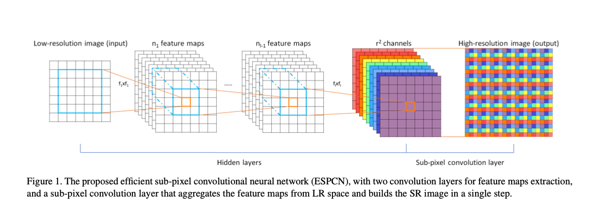
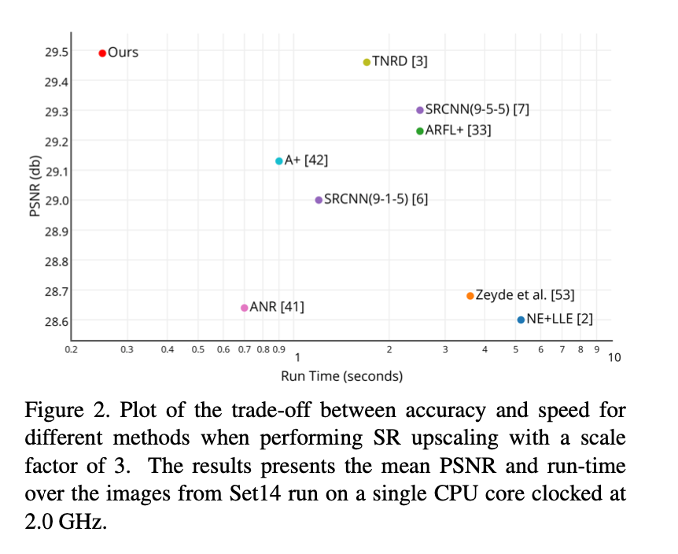
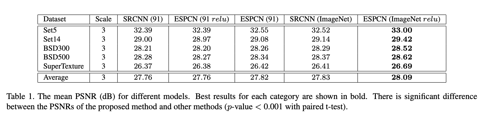

# ESPCN: Efficient Sub-Pixel Convolutional Neural Network

Real-Time Single Image and Video Super-Resolution Using an Efficient Sub-Pixel Convolutional Neural Network

本文核心：Efficient Sub-pixel Convolution。然而，虽然叫作 Sub-pixel Convolution 却并没有采用卷积操作。

## 整体架构

整个网络用了两个卷积层来提取特征，一个亚像素卷积层来整合特征。

**Input(1)->conv(5,64)->conv(3,32)->subpixel ->output(4)**

## 亚像素卷积层

几种上采样的方法：

1. Interpolation, 比如 SRCNN 就用简单的 bicubic 插值进行初步的上采样，然后进行学习非线性映射。

2. deconvolution, FSRCNN 在最后的上采样层，通过学习最后的 deconvolution layer。但 deconvolution 本质上是可以看做一种特殊的卷积，理论上后面要通过 stack filters 才能使得性能有更大的提升。 
3. 本文提到的亚像素卷积 sub-pixel Layer，其实跟常规的卷积层没有什么不同，不同的是其输出的特征通道数为 $r^2$，其中 r 为缩放倍数。 

$I^{SR} =f^L(I^{LR})=\mathcal PS(W_L*f_{L−1}(I^{LR})+b_L)$

其中 $\mathcal PS$ 表示 **periodic shuffling** 算子，将 $H\times W\times C\cdot r^2$ 张量的元素重新排列成 $rH\times rW\times C$ 形状的张量。

本质上就是将低分辨率特征，按照特定位置，周期性的插入到高分辨率图像中，可以通过颜色观测到上图的插入方式。

## 结果

速度上是相当快，基本上能在视频上进行实时处理。

